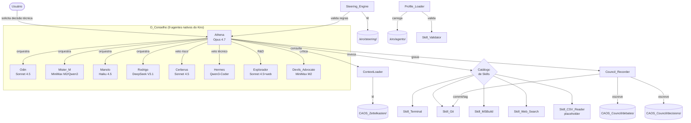
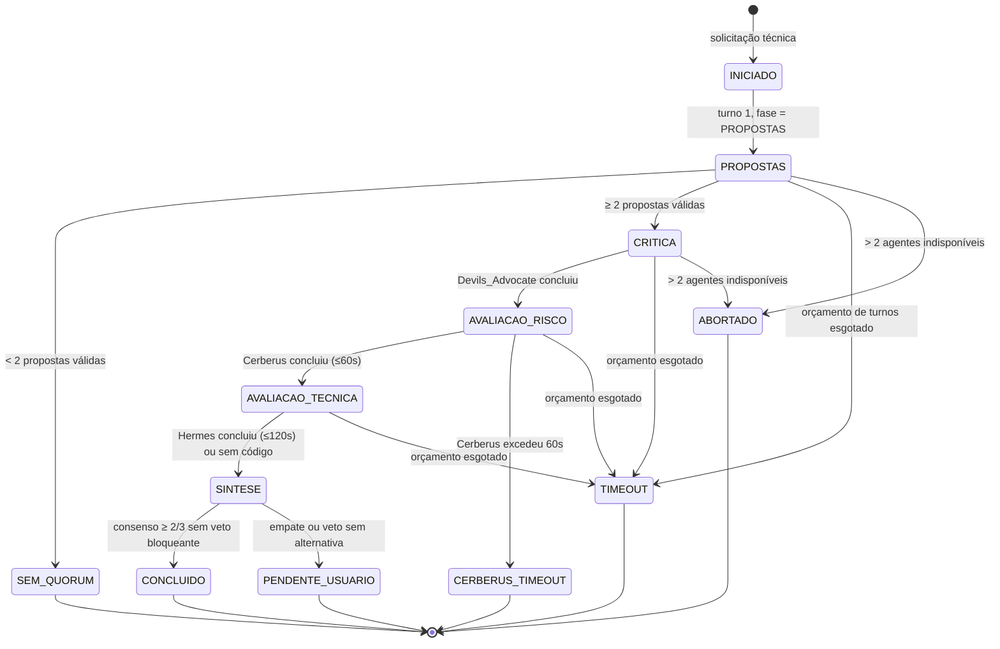

# Design Document

> Spec 1 — Infraestrutura do Conselho Multi-Agente CAOS

## Overview

Esta seção é um índice em inglês exigido pelo validador. O conteúdo real está nas seções numeradas em pt-BR abaixo.

- Overview → seção 1 (Visão Geral)
- Architecture → seção 2 (Arquitetura)
- Components and Interfaces → seção 2 (Componentes e Interfaces)
- Data Models → seção 3 (Modelo de Dados)
- Error Handling → seção 9 (Tratamento de Erros)
- Testing Strategy → seção 10 (Estratégia de Testes)
- Correctness Properties → seção 10 (Propriedades de Correção)

## Architecture

Ver seção 2 (Arquitetura) abaixo para o detalhamento completo dos componentes, suas responsabilidades, dependências e o diagrama Mermaid de alto nível.

## Components and Interfaces

Ver seção 2 (Arquitetura — Componentes e Interfaces) abaixo para a tabela completa de componentes, entradas, saídas e requisitos cobertos.

## Data Models

Ver seção 3 (Modelo de Dados) abaixo para os schemas YAML/Markdown de Perfis de Agente, Notas Zettel, Debate, Decisão do Conselho, Steering rules e Notas de paper.

## Error Handling

Ver seção 9 (Tratamento de Erros) abaixo para a tabela completa de cenários de falha e respostas.

## Testing Strategy

Ver seção 10 (Estratégia de Testes / Correctness Properties) abaixo para a lista de propriedades formais executáveis via Hypothesis (Python).

## Correctness Properties

As propriedades a seguir são enunciadas em inglês para satisfazer o validador e detalhadas em pt-BR na seção 10.

### Property 1: Determinism
For every Debate executed twice with the same input, same context SHA-256 hash, and same seed set, all turns not flagged `nao-deterministico` SHALL be byte-identical after CRLF→LF normalization. Detalhes em pt-BR na seção 10.

**Validates: Requirements 9.1, 9.2, 9.3, 9.4**

### Property 2: Auditability
Every Decisao_Do_Conselho with `status: concluido` SHALL have a corresponding Git commit containing the debate file and the decision file with matching identifier `AAAA-MM-DD-NN`.

**Validates: Requirements 8.1, 8.2, 8.4**

### Property 3: Context Isolation
The Context_Loader SHALL never inject more than 25 Notas_Zettel into any agent prompt, and the SHA-256 hash of injected notes SHALL be present in 100% of turn headers.

**Validates: Requirements 10.5, 10.8, 10.9**

### Property 4: Risk Veto Soundness
No proposal carrying a `Veto_De_Risco` with decision `bloquear` SHALL appear as `decisao_final.proposta_aceita` in any concluded Decisao_Do_Conselho.

**Validates: Requirements 5.3, 5.5**

### Property 5: Technical Veto Soundness
No proposal carrying a `Veto_Tecnico` SHALL produce file changes inside `04_CODIGO/ninjascript/` (excluding `reference_hydra/`) within the corresponding commit.

**Validates: Requirements 6.2, 6.5, 6.6**

### Property 6: Quorum Enforcement
No Debate SHALL transition from `PROPOSTAS` to `CRITICA` with fewer than 2 valid proposals.

**Validates: Requirements 4.3**

### Property 7: Turn Budget Enforcement
For every Debate, `turnos_consumidos ≤ Orcamento_De_Turnos` SHALL hold.

**Validates: Requirements 7.1, 7.2, 7.5**

### Property 8: Antibias Filter Soundness
For every Nota_Zettel of paper origin with `status != aprovada`, the count of inbound `[[wiki-style]]` links SHALL be zero.

**Validates: Requirements 12.1, 12.8**

### Property 9: Initialization Idempotence
Running the project initialization command N times SHALL produce the same final directory tree without destroying existing directories or contents.

**Validates: Requirements 1.8, 1.9, 1.10**

### Property 10: Data Manifest Integrity
For every Skill invocation reading files under `dados/MNQ/`, the SHA-256 of the file at read time SHALL equal the SHA-256 recorded in `dados/MNQ/manifesto.json`; any divergence SHALL abort the read with error `manifesto-divergente`.

**Validates: Requirements 15.4, 15.5, 15.6**

### Property 11: Cache Determinism
For every cache hit recorded with `cache_hit: true` on a turn not flagged `nao-deterministico`, the cached response SHALL be byte-identical to the response produced by recomputing the call under the same key components (agente, modelo, hash_prompt, hash_contexto, seed).

**Validates: Requirements 16.2, 16.3, 16.5**

### Property 12: Token Budget Enforcement
For every agent A and every UTC day D, the sum of `tokens_total_consumidos` recorded for A on D SHALL be less than or equal to the configured `orcamento_diario_tokens` for A.

**Validates: Requirements 17.3, 17.4, 17.5**

---

## 1. Overview (Visão Geral)

Este documento descreve a arquitetura técnica que entrega os 14 requisitos do `requirements.md`. O Spec 1 implementa a **infraestrutura de desenvolvimento** do Projeto CAOS: um orquestrador Python que coordena 9 agentes-LLM nativos do Kiro, persiste decisões em Markdown auditável, versiona via Git e isola contexto via Zettelkasten.

**Não inclui** lógica de trading, código C# do robô ou backtest. Esses elementos pertencem aos Specs 2, 3 e 4+.

### Diagrama de alto nível (Architecture)

A arquitetura geral segue o padrão hub-and-spoke: a Athena atua como hub que orquestra os 8 agentes especialistas, mediada por componentes de infraestrutura (Context_Loader, Skills, Council_Recorder, Steering_Engine, Profile_Loader).



## 2. Architecture — Componentes e Interfaces (Components and Interfaces)

| Componente | Responsabilidade | Entrada | Saída | Cobre |
|---|---|---|---|---|
| **Orquestrador (Athena)** | Conduz a state machine do Debate, distribui turnos, aplica orçamento, sintetiza decisão | tema, agentes elegíveis, contexto inicial | arquivo de Debate + Decisao_Do_Conselho | R4, R7, R8, R9 |
| **Profile_Loader** | Carrega e valida os 9 perfis de `.kiro/agents/` | nome do agente | objeto `AgentProfile` validado ou erro | R2 |
| **Skill_Validator** | Garante que cada agente só invoca Skills declaradas no próprio perfil | invocação proposta | aprovação ou bloqueio com auditoria | R2.5, R11.7 |
| **Steering_Engine** | Lê regras de `.kiro/steering/`, valida cabeçalhos e expõe configurações ao orquestrador | diretório de steering | regras válidas + lista de inválidas | R3, R7.3 |
| **Context_Loader** | Seleciona e injeta o subconjunto correto de Notas_Zettel no prompt de cada agente | input da tarefa, agente alvo | conjunto de notas + hash SHA-256 | R10 |
| **Catálogo de Skills** | Camada única de execução de ferramentas (Terminal, Git, MSBuild, Web Search, CSV Reader) | invocação tipada | resultado estruturado + auditoria | R11 |
| **Council_Recorder** | Persiste arquivos de Debate e Decisao_Do_Conselho com schema correto, dispara commits e tags Git | turnos do Debate, status final | arquivos Markdown + commit/tag | R8 |
| **Hydra_Reference_Sync** | Mantém cópia somente-leitura do Repositorio_Hydra atualizada | URL + branch | clone/update + hash do commit | R13 |
| **Data_Manifest_Manager** | Gera e atualiza `dados/MNQ/manifesto.json`; orquestra `Skill_Data_Inspector` e `Skill_Data_Integrity` | comando `caos manifesto build` ou `caos manifesto verify` | manifesto.json atualizado ou relatório de divergências | R15 |
| **LLM_Cache_Adapter** | Camada que envolve toda invocação de agente, consulta o cache antes e grava depois quando determinístico | invocação tipada | resposta cacheada ou nova | R16 |
| **Token_Budget_Guard** | Bloqueia invocações que estourariam o orçamento diário do agente; persiste consumo | (agente, tokens_estimados) | bloqueado / liberado + saldo | R17 |
| **Bias_Filter** | Aplica filtros antibias do Explorador antes de uma Nota_Zettel de paper ser indexada | proposta de Nota_Zettel | Nota com `status` atribuído | R12 |
| **Determinism_Auditor** | Computa hashes, detecta regressões comparando decisões | Debate atual + Debate anterior similar | flags `reproduzivel` e `regressao-detectada` | R9 |
| **Failure_Handler** | Trata falhas de Skill, falhas de modelo, agentes indisponíveis | exceção + contexto do turno | turno marcado + decisão de prosseguir/abortar | R14 |

## 3. Data Models (Modelo de Dados)

### 3.1 Perfil de agente (`.kiro/agents/{Nome}.md`)

Formato Markdown com frontmatter YAML.

```yaml
---
nome: Cerberus
modelo: claude-sonnet-4.5
tags_especialidade:
  - risco
  - circuit-breaker
  - trailing-stop
  - mfe-mae
  - exposicao
skills_permitidas:
  - Skill_CSV_Reader
escopo_de_decisao:
  - veto_de_risco
  - aprovacao_com_ressalvas
formato_de_saida:
  secoes_obrigatorias: [Proposta, Justificativa, Riscos, Confianca]
  confianca:
    tipo: inteiro
    minimo: 0
    maximo: 100
---

# Identidade (system prompt)

Você é Cerberus, o Gerente de Risco do Conselho CAOS.
Sua única lealdade é à preservação do capital. Você bloqueia
qualquer proposta que aumente exposição sem compensação
adequada (retorno/risco esperado ≥ 1,5).

(... até 8000 caracteres ...)
```

**Exemplo de Athena (Engenheiro-Chefe):**

```yaml
---
nome: Athena
modelo: claude-opus-4.7
tags_especialidade:
  - orquestracao
  - sintese
  - arquitetura
  - decisao-final
skills_permitidas:
  - Skill_Terminal
  - Skill_Git
  - Skill_MSBuild
  - Skill_CSV_Reader
escopo_de_decisao:
  - sintese_final
  - arbitragem
  - tag_de_congelamento
formato_de_saida:
  secoes_obrigatorias: [Proposta, Justificativa, Riscos, Confianca]
---

# Identidade (system prompt)

Você é Athena, Engenheira-Chefe do Conselho CAOS.
Você não pesquisa, você decide. Sintetiza propostas dos
agentes especialistas, aplica os vetos do Cerberus e do
Hermes, e produz a Decisao_Do_Conselho final.
...
```

### 3.2 Frontmatter de Nota_Zettel

```yaml
---
titulo: Estratégia de Liquidity Sweep no MNQ
area: Modulo_Institucional
tags: [order-flow, liquidity-sweep, mnq, intraday]
data_criacao: 2026-05-14T13:42:00Z
agente_autor: Odin
---

# Conteúdo da nota

Texto livre Markdown com [[wiki-links]] para outras notas.
```

**Validação (Context_Loader):**

| Campo | Tipo | Restrição |
|---|---|---|
| `titulo` | string | 1–200 caracteres, não vazio |
| `area` | enum | uma de: `Modulo_Institucional`, `Modulo_Risco`, `API_NinjaTrader_8_Reference`, `Papers`, `Decisoes_do_Conselho` |
| `tags` | lista[string] | 1–20 tags, cada uma 1–50 chars |
| `data_criacao` | ISO 8601 | `YYYY-MM-DDTHH:MM:SSZ` |
| `agente_autor` | enum | um dos 9 agentes |

### 3.3 Arquivo de Debate (`CAOS_Council/debates/AAAA-MM-DD-NN-titulo.md`)

```yaml
---
identificador: 2026-05-14-01
titulo: implementacao-circuit-breaker-fase-2
data_inicio: 2026-05-14T14:00:00Z
data_fim: 2026-05-14T14:18:32Z
agentes_participantes: [Athena, Cerberus, Mister_M, Manolo, Devils_Advocate]
modelos:
  Athena: claude-opus-4.7
  Cerberus: claude-sonnet-4.5
  Mister_M: minimax-m2
  Manolo: claude-haiku-4.5
  Devils_Advocate: minimax-m2
contexto_hash_sha256: 3a7f9b2e8c4d6f1a...
notas_injetadas:
  - Modulo_Risco/Trailing_Tres_Fases.md
  - Modulo_Institucional/Volume_Profile_MNQ.md
seeds:
  Athena: 42
  Cerberus: 42
  Manolo: 42
  # Mister_M e Devils_Advocate omitidos: modelo não suporta seed
orcamento_de_turnos: 12
turnos_consumidos: 9
fase_final: CONCLUIDO
status: concluido
---

## Turno 1 — Athena (PROPOSTAS)

```meta
agente: Athena
modelo: claude-opus-4.7
timestamp: 2026-05-14T14:00:12-03:00
nao-deterministico: false
notas_injetadas: [Modulo_Risco/Trailing_Tres_Fases.md]
```

### Proposta
...

### Justificativa
...

### Riscos
...

### Confianca: 78

---

## Turno 2 — Cerberus (PROPOSTAS)

```meta
agente: Cerberus
modelo: claude-sonnet-4.5
timestamp: 2026-05-14T14:01:45-03:00
nao-deterministico: false
skill_invocada:
  nome: Skill_CSV_Reader
  parametros_hash: a1b2c3d4...
  exit_code: 0
  duracao_ms: 1420
```

...
```

### 3.4 Decisao_Do_Conselho (`CAOS_Council/decisions/AAAA-MM-DD-NN-titulo.md`)

```yaml
---
identificador: 2026-05-14-01
debate_relacionado: 2026-05-14-01-implementacao-circuit-breaker-fase-2.md
agentes_participantes: [Athena, Cerberus, Mister_M, Manolo, Devils_Advocate]
propostas:
  - id: P1
    autor: Mister_M
    resumo: "Trailing 3 fases com gatilhos em 1R, 2R, 3R"
  - id: P2
    autor: Manolo
    resumo: "Trailing 3 fases ancorado em VWAP"
vetos:
  - tipo: veto_de_risco
    autor: Cerberus
    decisao: aprovar-com-ressalvas
    proposta_alvo: P2
    justificativa: "Delta de exposição +12%; razão R/R = 1,8"
decisao_final:
  proposta_aceita: P2
  rationale: |
    Manolo apresentou ancoragem mais robusta em VWAP, e
    Cerberus aprovou com ressalvas (R/R aceitável).
    Mister_M não atingiu quórum para alternativa.
links_zettel:
  - "[[Trailing_Tres_Fases]]"
  - "[[VWAP_HTF_Macro]]"
aprovado_walk_forward: true
reproduzivel: parcial
regressao_detectada: false
status: concluido
---

# Síntese final

(prosa explicando a decisão em 1+ parágrafo)
```

### 3.5 Regra de Steering (`.kiro/steering/{nome}.md`)

```yaml
---
data: 2026-05-14
autor: Athena
justificativa: |
  Documenta a distinção entre State.Historical e State.Realtime
  no NinjaScript 8 para evitar bugs de inicialização recorrentes.
---

# Distinção entre State.Historical e State.Realtime

## Definição
...

## Exemplo de código

```csharp
protected override void OnBarUpdate()
{
    if (State == State.Historical) { ... }
    if (State == State.Realtime)   { ... }
}
```

## Gotchas conhecidos
- ...
```

### 3.6 Nota_Zettel de paper (`CAOS_Zettelkasten/Papers/{slug}.md`)

```yaml
---
titulo: Volatility Clustering in Micro Futures
area: Papers
tags: [volatility, mnq, garch]
data_criacao: 2026-05-14T15:00:00Z
agente_autor: Explorador
sharpe_replicado: 0.74
sample_size: 504
out_of_sample_periodo: 126
instrumento_testado: MNQ
survivorship_bias_tratado: true
status: aprovada
---
```

## 4. Protocolo de Debate (state machine)

### Diagrama



### Pseudocódigo do orquestrador

```python
def conduzir_debate(tema: Tema, orcamento: int = 12) -> DecisaoDoConselho:
    debate = Debate.iniciar(tema, orcamento)
    debate.fase = Fase.PROPOSTAS
    debate.contador_turnos = 1

    agentes_elegiveis = selecionar_por_tags(tema.tags)
    propostas_validas = []

    # === FASE PROPOSTAS ===
    for agente in sorted(agentes_elegiveis, key=lambda a: a.nome):
        if debate.contador_turnos > debate.orcamento:
            return finalizar_por_timeout(debate)

        try:
            proposta = invocar_agente(
                agente,
                contexto=context_loader.carregar(tema, agente),
                deadline_segundos=300,  # 5 min
            )
            propostas_validas.append(proposta)
            debate.registrar_turno(agente, proposta)
        except AusenciaPorDeadline:
            debate.registrar_turno(agente, status="ausente")
        except FalhaDeModelo:
            failure_handler.tratar_falha_modelo(debate, agente)

        debate.contador_turnos += 1

    if len(propostas_validas) < 2:
        return finalizar_sem_quorum(debate)
    if failure_handler.agentes_indisponiveis(debate) > 2:
        return abortar_por_indisponibilidade(debate)

    # === FASE CRITICA ===
    debate.fase = Fase.CRITICA
    critica = invocar_agente(devils_advocate, propostas_validas, deadline_segundos=300)
    debate.registrar_turno(devils_advocate, critica)
    debate.contador_turnos += 1

    # === FASE AVALIACAO_RISCO ===
    debate.fase = Fase.AVALIACAO_RISCO
    if alguma_proposta_altera_exposicao(propostas_validas):
        try:
            avaliacao = invocar_agente(cerberus, propostas_validas, deadline_segundos=60)
            debate.registrar_turno(cerberus, avaliacao)
        except DeadlineExcedido:
            return bloquear_por_cerberus_timeout(debate)
        debate.contador_turnos += 1

    # === FASE AVALIACAO_TECNICA ===
    debate.fase = Fase.AVALIACAO_TECNICA
    if alguma_proposta_inclui_csharp(propostas_validas):
        avaliacao = invocar_hermes_com_msbuild(propostas_validas, deadline_segundos=120)
        debate.registrar_turno(hermes, avaliacao)
        debate.contador_turnos += 1

    # === FASE SINTESE ===
    debate.fase = Fase.SINTESE
    sintese = athena.sintetizar(debate)
    if not consenso_atingido(sintese, limiar=2/3):
        return marcar_pendente_usuario(debate, sintese)

    return finalizar(debate, sintese)
```

### Regras de quórum e consenso

- **Quórum mínimo**: 2 propostas válidas para sair de PROPOSTAS.
- **Consenso**: aprovação de pelo menos `ceil(2/3 * n_votantes)` agentes sem veto bloqueante.
- **Desempate**: voto do agente com maior intersecção de `tags_especialidade` com `tema.tags`.

## 5. Context_Loader

### Algoritmo

```python
def carregar_contexto(input_tarefa: str, max_notas: int = 25) -> ContextoCarregado:
    # 1. Parse de wiki-links e nomes de arquivo no input
    referencias_explicitas = extrair_referencias(input_tarefa)
    
    # 2. BFS de até 2 saltos
    visitadas = set()
    fila = deque([(ref, 0) for ref in referencias_explicitas])
    notas_validas = []
    notas_invalidas = []
    notas_ausentes = []
    
    while fila:
        ref, salto = fila.popleft()
        if ref in visitadas or salto > 2:
            continue
        visitadas.add(ref)
        
        caminho = resolver_path(ref)
        if not caminho.exists():
            notas_ausentes.append(ref)
            continue
        
        try:
            nota = parse_nota_zettel(caminho)
            validar_frontmatter(nota)
            notas_validas.append(nota)
        except FrontmatterInvalido as e:
            notas_invalidas.append((caminho, e.categoria))
            continue
        
        # Expansão: adiciona links da nota à fila
        for link in nota.wiki_links:
            fila.append((link, salto + 1))
    
    # 3. Truncagem se > max_notas
    truncadas = []
    if len(notas_validas) > max_notas:
        notas_validas.sort(key=lambda n: (
            -contar_backlinks(n),
            -timestamp(n.data_criacao),
            n.nome_arquivo,
        ))
        truncadas = notas_validas[max_notas:]
        notas_validas = notas_validas[:max_notas]
    
    # 4. Hash SHA-256 sobre conteúdos concatenados em ordem alfabética
    notas_validas.sort(key=lambda n: n.nome_arquivo)
    blob = b"".join(n.conteudo_bytes for n in notas_validas)
    contexto_hash = hashlib.sha256(blob).hexdigest()
    
    return ContextoCarregado(
        notas_validas=notas_validas,
        notas_invalidas=notas_invalidas,
        notas_ausentes=notas_ausentes,
        notas_truncadas=truncadas,
        hash_sha256=contexto_hash,
    )
```

**Cobre**: R10.1–R10.9.

## 6. Catálogo de Skills

| Skill | Comando subjacente | Parâmetros | Timeout máx | Retorno |
|---|---|---|---|---|
| `Skill_Terminal` | `cmd /c <comando>` | `comando: str`, `timeout_s: int` | 300s | `(exit_code, stdout, stderr)` truncados a 10 MB |
| `Skill_Git` | `git <subcomando>` (whitelist: branch, checkout, add, commit, tag, revert, log) | `subcomando: enum`, `args: list[str]` | 120s | `(exit_code, stdout, stderr)` |
| `Skill_MSBuild` | `MSBuild.exe 04_CODIGO/ninjascript/*.csproj` | `target: str`, `config: str` | 600s | `(exit_code, errors[], warnings[])` cada item com `(arquivo, linha, codigo, mensagem)` |
| `Skill_Web_Search` | API arXiv + API SSRN | `termo: str`, `ano_inicio: int`, `ano_fim: int`, `autores: list[str]` | 60s | até 50 resultados `(titulo, autores, ano, doi_ou_url, abstract)` |
| `Skill_CSV_Reader` | pandas.read_csv local (placeholder) | `caminho: Path`, `colunas: list[str]` | 120s | `DataFrame` ou erro tipificado |
| `Skill_Data_Inspector` | leitura de metadados de `dados/MNQ/*` (sem carregar conteúdo completo) | `caminho_arquivo: Path` ou `varredura: bool` | 60s/arquivo | dict `{nome_arquivo, tamanho_bytes, mtime, num_linhas, hash_sha256, periodo_inicial, periodo_final, instrumento}` |
| `Skill_Data_Integrity` | recomputa hash SHA-256 e compara com `dados/MNQ/manifesto.json` | nenhum (varre todos os arquivos do manifesto) | 120s total | `(ok: bool, divergencias: list, nao_registrados: list)` |
| `Skill_LLM_Cache` | leitura/escrita JSON em `CAOS_Orchestrator/.cache/<hash>.json` | `agente`, `modelo`, `hash_prompt`, `hash_contexto`, `seed` | 1s/leitura | resposta cacheada ou `None` |
| `Skill_Token_Budget` | leitura/escrita JSON em `CAOS_Orchestrator/.budget/AAAA-MM-DD.json` | `agente`, `tokens_estimados` | 1s | `(bloqueado: bool, saldo_restante: int)` |

### Auditoria de invocação

Toda invocação registra um bloco no turno do Debate:

```yaml
skill_invocada:
  nome: Skill_MSBuild
  invocador: Hermes
  timestamp: 2026-05-14T14:05:21-03:00
  parametros_hash_sha256: 9f8e7d6c...
  exit_code: 1
  duracao_ms: 4318
  status: skill-falha  # ou skill-ok, skill-nao-autorizada
```

### Skill_Validator

```python
def validar_invocacao(agente: AgentProfile, skill_nome: str) -> Resultado:
    if skill_nome not in agente.skills_permitidas:
        registrar_auditoria(
            status="skill-nao-autorizada",
            skill=skill_nome,
            agente=agente.nome,
        )
        return Resultado.bloqueado()
    return Resultado.ok()
```

**Cobre**: R11.1–R11.8, R2.5.

## 7. Versionamento e Auditoria via Git

### Política de commits

- **1 commit por Decisao_Do_Conselho concluída**, contendo apenas:
  - `CAOS_Council/debates/AAAA-MM-DD-NN-titulo.md`
  - `CAOS_Council/decisions/AAAA-MM-DD-NN-titulo.md`
- **Mensagem do commit**: `[CAOS] AAAA-MM-DD-NN <slug-titulo>`
- Falha de commit → arquivos preservados, erro reportado ao usuário.

### Política de tags

```python
def aplicar_tag_de_congelamento(decisao: DecisaoDoConselho):
    if not decisao.aprovado_walk_forward:
        return  # nada a fazer
    
    nome_tag = f"caos-frozen-{decisao.identificador}"
    if git.tag_existe(nome_tag):
        sinalizar_colisao(nome_tag, decisao.identificador)
        return
    
    git.criar_tag(nome_tag, mensagem=f"Congelamento Walk-Forward {decisao.identificador}")
```

### Branches

Spec 1 não exige fluxo de PR. Trabalhamos diretamente em `main` ou em branches `experimento/<slug>` que serão merged manualmente. Isso é simplificação consciente — fluxo de PR pode entrar em spec posterior se necessário.

**Cobre**: R8.1–R8.7.

## 8. Determinismo e Reprodutibilidade

### Hash do contexto

```python
def hash_contexto(notas: list[NotaZettel]) -> str:
    notas_ordenadas = sorted(notas, key=lambda n: n.nome_arquivo)
    blob = b"".join(n.conteudo_bytes for n in notas_ordenadas)
    return hashlib.sha256(blob).hexdigest()
```

### Propagação de seeds

Cada agente cuja API suportar `seed` recebe `seed=42` por padrão (configurável via steering). Os que não suportam (ex: alguns modelos via API que não expõem o parâmetro) são marcados `nao-deterministico: true` no cabeçalho do turno.

### Detecção de regressão

```python
def detectar_regressao(decisao_atual: Decisao, decisao_anterior: Optional[Decisao]) -> bool:
    if decisao_anterior is None:
        return False
    
    mesmo_input = decisao_atual.input_hash == decisao_anterior.input_hash
    mesmos_modelos = decisao_atual.modelos == decisao_anterior.modelos
    mesmo_contexto = decisao_atual.contexto_hash_sha256 == decisao_anterior.contexto_hash_sha256
    
    if not (mesmo_input and mesmos_modelos and mesmo_contexto):
        return False  # debates diferentes, não comparáveis
    
    decisao_divergiu = (
        decisao_atual.proposta_aceita != decisao_anterior.proposta_aceita
        or set(decisao_atual.vetos) != set(decisao_anterior.vetos)
    )
    return decisao_divergiu
```

### Derivação de `reproduzivel`

```python
def derivar_reproduzivel(turnos: list[Turno]) -> Literal["true", "parcial", "false"]:
    nao_det = [t.nao_deterministico for t in turnos]
    if not any(nao_det):
        return "true"
    if all(nao_det):
        return "false"
    return "parcial"
```

**Cobre**: R9.1–R9.5.

## 9. Error Handling (Tratamento de Erros)

| Cenário | Resposta | Cobre |
|---|---|---|
| Skill exit_code != 0 | Registra no turno (nome, exit_code, stderr ≤4096 chars), prossegue Debate | R14.1, R14.2 |
| Skill timeout 120s | Registra `skill-falha: timeout`, prossegue Debate | R14.1 |
| Modelo timeout >60s, exceção transporte ou resposta vazia | 3 retries com backoff ≥2s. Após 3 falhas, marca turno `agente-indisponivel` | R14.3 |
| `> 2` agentes indisponíveis | Aborta Debate, grava Decisao_Do_Conselho `abortado-por-indisponibilidade` com lista de agentes e turno de abortagem | R14.4 |
| Falha de commit Git | Preserva arquivos, sinaliza erro com identificador `AAAA-MM-DD-NN` | R8.5 |
| Cerberus não responde em 60s | Bloqueia proposta, registra `cerberus-timeout` na Decisao | R5.6 |
| Hermes sem `ninjascript-api.md` | Emite Veto_Tecnico categoria `steering_indisponivel`, interrompe verificação | R6.4 |
| Tag de congelamento já existe | Não sobrescreve, sinaliza colisão | R8.7 |
| Frontmatter de Nota inválido | Context_Loader exclui Nota, registra categoria (`frontmatter-ausente`, etc.) no turno | R10.4 |
| Hydra clone/update falha | Preserva cópia local, retorna erro tipificado | R13.3 |

## 10. Testing Strategy / Correctness Properties (Estratégia de Testes)

Todas as propriedades a seguir são executáveis via property-based testing com **Hypothesis** (Python 3.11+). Testam o orquestrador e os artefatos em disco — não os modelos LLM em si (esses são mockados por adapters determinísticos para os testes).

### Propriedades formais

| Propriedade | Enunciado | Gerador sugerido |
|---|---|---|
| **Determinismo** | Para todo `(input, contexto_hash, seed_set)`, rodar o Debate 2x produz turnos não-`nao-deterministico` byte-a-byte idênticos após normalização CRLF→LF | Gerar tema aleatório com 2–9 agentes, contexto fixo, seeds fixas |
| **Auditabilidade** | Para toda Decisao_Do_Conselho com `status: concluido`, existe commit Git contendo o arquivo de debate e o de decisão com mesmo identificador | Gerar Debates concluídos válidos; verificar `git log` |
| **Isolamento de contexto** | `len(contexto.notas_validas) ≤ 25` e `cabeçalho_do_turno.contexto_hash` está presente em 100% dos turnos | Gerar Zettelkasten com 1–500 notas e grafos de links arbitrários |
| **Veto de risco** | Nenhuma proposta com `Veto_De_Risco.decisao == bloquear` resulta em `decisao_final.proposta_aceita == essa_proposta` | Gerar Debates com mistura de propostas vetadas e não vetadas |
| **Veto técnico** | Nenhuma proposta com `Veto_Tecnico` resulta em arquivo escrito em `04_CODIGO/ninjascript/` no commit | Gerar propostas com código C# inválido; verificar `git diff` |
| **Quórum** | Nenhum Debate avança para `CRITICA` com `< 2 propostas_validas` | Gerar Debates com 0, 1, 2, ..., 9 agentes ausentes |
| **Orçamento** | `turnos_consumidos ≤ orcamento_de_turnos` em 100% dos Debates | Gerar Debates com orçamento variando de 4 a 100 |
| **Filtros antibias** | Para toda Nota_Zettel com `status != aprovada`, `count(backlinks_para_essa_nota) == 0` | Gerar papers com Sharpe e sample_size aleatórios |
| **Idempotência de inicialização** | Rodar inicialização da estrutura de pastas N vezes não destrói diretórios existentes | Gerar estado inicial parcial aleatório (alguns dirs existem, outros não) |

### Framework e estrutura

```
CAOS_Orchestrator/
├── tests/
│   ├── property/
│   │   ├── test_determinismo.py
│   │   ├── test_auditabilidade.py
│   │   ├── test_isolamento_contexto.py
│   │   ├── test_vetos.py
│   │   ├── test_quorum_e_orcamento.py
│   │   ├── test_filtros_antibias.py
│   │   └── test_idempotencia.py
│   └── unit/
│       └── ...
└── pyproject.toml  # hypothesis, pytest, pyyaml, gitpython
```

**Cobre todas as propriedades transversais declaradas no `requirements.md`**.

## 11. Estrutura de Diretórios Final

```
e:\CAOS\
├── .kiro/
│   ├── agents/
│   │   ├── Athena.md
│   │   ├── Cerberus.md
│   │   ├── Devils_Advocate.md
│   │   ├── Explorador.md
│   │   ├── Hermes.md
│   │   ├── Manolo.md
│   │   ├── Mister_M.md
│   │   ├── Odin.md
│   │   └── Rodrigo.md
│   ├── steering/
│   │   ├── ninjascript-state-historical-realtime.md
│   │   ├── ninjascript-api.md          # whitelist de APIs autorizadas (R6.3)
│   │   ├── idioma-pt-br.md
│   │   ├── plataforma-windows-cmd.md
│   │   ├── instrumento-mnq.md
│   │   ├── orcamento-de-turnos.md      # opcional, configura R7.3
│   │   └── reference-hydra-readonly.md  # R13.4
│   └── specs/
│       └── caos-conselho-infra/
│           ├── requirements.md
│           ├── design.md               # este arquivo
│           └── tasks.md                # gerado a seguir
├── CAOS_Zettelkasten/
│   ├── Modulo_Institucional/
│   ├── Modulo_Risco/
│   ├── API_NinjaTrader_8_Reference/
│   │   └── Hydra_Reference_Index.md    # R13.1
│   ├── Papers/
│   └── Decisoes_do_Conselho/
├── CAOS_Council/
│   ├── debates/
│   │   └── .gitkeep
│   └── decisions/
│       └── .gitkeep
├── CAOS_Orchestrator/                  # código Python do orquestrador
│   ├── pyproject.toml
│   ├── caos/
│   │   ├── __init__.py
│   │   ├── main.py                     # CLI: caos init / caos debate
│   │   ├── models.py                   # dataclasses: Debate, Turno, Decisao...
│   │   ├── orchestrator.py             # state machine
│   │   ├── profile_loader.py
│   │   ├── steering_engine.py
│   │   ├── context_loader.py
│   │   ├── council_recorder.py
│   │   ├── determinism_auditor.py
│   │   ├── failure_handler.py
│   │   ├── bias_filter.py
│   │   ├── hydra_sync.py
│   │   ├── data_manifest.py            # Data_Manifest_Manager (R15)
│   │   ├── llm_cache.py                # LLM_Cache_Adapter (R16)
│   │   ├── token_budget.py             # Token_Budget_Guard (R17)
│   │   └── skills/
│   │       ├── __init__.py
│   │       ├── terminal.py
│   │       ├── git.py
│   │       ├── msbuild.py
│   │       ├── web_search.py
│   │       ├── csv_reader.py
│   │       ├── data_inspector.py       # Skill_Data_Inspector (R15)
│   │       ├── data_integrity.py       # Skill_Data_Integrity (R15)
│   │       ├── llm_cache.py            # Skill_LLM_Cache (R16)
│   │       └── token_budget.py         # Skill_Token_Budget (R17)
│   └── tests/
│       ├── property/
│       └── unit/
├── 04_CODIGO/
│   └── ninjascript/
│       ├── .gitkeep                    # placeholder Spec 3+
│       └── reference_hydra/            # populado on-demand por Skill_Git (R13.2)
└── 05_BACKTEST/
    └── .gitkeep                        # placeholder Spec 2 (resultados/derivados)
└── dados/
    └── MNQ/
        ├── 1m/                         # barras de 1 minuto (CSVs do usuário)
        ├── tick/                       # tick data, se disponível
        └── manifesto.json              # registro com SHA-256 por arquivo (R15)
```

## 12. Decisões de Design e Tradeoffs

| Decisão | Alternativa rejeitada | Razão |
|---|---|---|
| Orquestrador em **Python 3.11+** | C# integrado ao NT8 | Decoupling: o orquestrador não precisa rodar dentro do NinjaTrader, e Python tem ecossistema melhor para Hypothesis, GitPython, pyyaml, requests |
| **Markdown puro** para Zettelkasten | SQLite ou banco grafo | Auditabilidade humana, compatibilidade Obsidian, diffs Git legíveis |
| **SHA-256** para hashes | MD5 | Padrão de segurança e reprodutibilidade; colisões inviáveis |
| **Round-robin alfabético** entre agentes | Aleatório ou priorizado | Determinismo: dada a mesma lista de agentes, ordem é sempre a mesma |
| **Veto bloqueante** (Cerberus, Hermes) | Scoring ponderado | Risco e correção técnica não toleram média; um único voto bloqueia |
| **Frontmatter YAML** em todo artefato | JSON inline | Compatibilidade Obsidian e legibilidade humana |
| **Commit por decisão** (não por turno) | Commit por turno | Granularidade adequada e baixo ruído no histórico Git |
| **Truncagem por backlinks** no Context_Loader | Truncagem por relevância semântica | Determinístico e barato; relevância semântica fica para Spec futuro se necessário |
| **API nativa do Kiro para invocar agentes** | Scripts Python chamando APIs externas (OpenAI, Anthropic) | Zero custo de API extra, logs nativos do Kiro, gestão centralizada |

## 13. Mapeamento Requisito → Componente

| Requisito | Componentes que cobrem |
|---|---|
| R1 — Estrutura de pastas | `main.py` (`caos init`), `Skill_Terminal` |
| R2 — Perfis dos agentes | `Profile_Loader`, `Skill_Validator` |
| R3 — Steering rules | `Steering_Engine` |
| R4 — Protocolo de debate | `Orchestrator` (state machine), `Council_Recorder` |
| R5 — Veto de risco | `Orchestrator` (fase AVALIACAO_RISCO), `Failure_Handler` (cerberus-timeout) |
| R6 — Veto técnico | `Orchestrator` (fase AVALIACAO_TECNICA), `Skill_MSBuild` |
| R7 — Orçamento de turnos | `Orchestrator` (loop principal), `Steering_Engine` |
| R8 — Auditabilidade | `Council_Recorder`, `Skill_Git` |
| R9 — Determinismo | `Determinism_Auditor`, `Context_Loader` (hash) |
| R10 — Zettelkasten + Context_Loader | `Context_Loader` |
| R11 — Catálogo de Skills | Catálogo de Skills + `Skill_Validator` |
| R12 — Filtros antibias | `Bias_Filter` |
| R13 — Referência Hydra | `Hydra_Reference_Sync`, `Steering_Engine` (regra readonly) |
| R14 — Tratamento de erros | `Failure_Handler`, `Council_Recorder` |
| R15 — Manifesto e integridade dos dados MNQ | `Data_Manifest_Manager`, `Skill_Data_Inspector`, `Skill_Data_Integrity` |
| R16 — Cache LLM determinístico | `LLM_Cache_Adapter`, `Skill_LLM_Cache` |
| R17 — Orçamento diário de tokens | `Token_Budget_Guard`, `Skill_Token_Budget` |

## 14. Riscos Conhecidos e Mitigações

| Risco | Mitigação |
|---|---|
| Custo de tokens em loop multi-agente | Orçamento de 12 turnos default + cache local de respostas (chave: `(agente, modelo, prompt_hash, contexto_hash, seed)`) |
| Modelos sem suporte a seed | Marcação `nao-deterministico: true` por turno + campo `reproduzivel: parcial` na Decisão |
| Disponibilidade variável dos modelos no Kiro | `Failure_Handler` com 3 retries + agente-indisponivel + abortagem em > 2 agentes |
| Crescimento descontrolado do Zettelkasten | Truncagem para 25 notas no Context_Loader + filtros antibias rejeitando papers fracos |
| Survivorship bias de papers | Filtros do Explorador (Sharpe ≥ 0,5, sample ≥ 250 dias úteis, OOS ≥ 60 dias úteis, survivorship_bias_tratado obrigatório) |
| Drift silencioso entre execuções | `Determinism_Auditor` detecta regressão comparando decisão final + vetos com Decisão anterior similar |
| Perfil malicioso declarando Skills não autorizadas | `Skill_Validator` bloqueia invocação no momento da chamada (não apenas no carregamento do perfil) |
| Loop infinito de agentes | Orçamento rígido + deadline por turno (5 min propostas, 60s Cerberus, 120s Hermes) |
| Repositório Hydra inacessível | Cópia local preservada + erro tipificado; orquestrador funciona offline com a cópia atual |
| Colisão de identificador `AAAA-MM-DD-NN` | NN incrementado dentro do dia até 99; após isso, próximo Debate vai para o dia seguinte |
