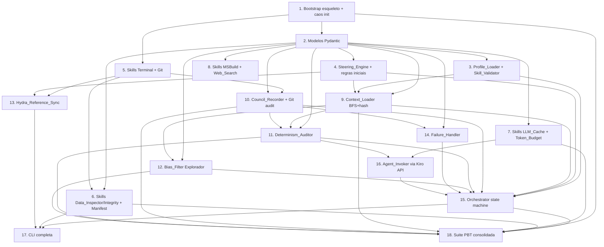

# Implementation Plan

> Spec 1 — Infraestrutura do Conselho Multi-Agente CAOS

## Overview

Este plano fatia o `design.md` em 18 tarefas executáveis pelo subagente `spec-task-execution` do Kiro. A ordem reflete dependências: primeiro o esqueleto Python e os modelos, depois Skills isoladas (que não dependem do orquestrador), depois os componentes que orquestram (Context_Loader, Recorder, Failure_Handler), e por fim a state machine do Debate e a CLI.

Convenções:
- Linguagem do orquestrador: Python 3.11+.
- Plataforma: Windows + cmd.
- Idioma de comentários, docstrings e mensagens de log: pt-BR.
- Toda tarefa que envolve Python deve adicionar/atualizar testes na pasta correspondente em `CAOS_Orchestrator/tests/`.
- Cada tarefa cita os requisitos cobertos e, quando aplicável, a Property de PBT que será validada.

## Task Dependency Graph



```json
{
  "waves": [
    {
      "wave": 1,
      "tasks": ["1"]
    },
    {
      "wave": 2,
      "tasks": ["2", "5"]
    },
    {
      "wave": 3,
      "tasks": ["3", "4", "7", "8"]
    },
    {
      "wave": 4,
      "tasks": ["6", "9", "10", "12", "13"]
    },
    {
      "wave": 5,
      "tasks": ["11", "14", "16"]
    },
    {
      "wave": 6,
      "tasks": ["15"]
    },
    {
      "wave": 7,
      "tasks": ["17", "18"]
    }
  ],
  "dependencies": {
    "1": [],
    "2": ["1"],
    "3": ["2"],
    "4": ["2"],
    "5": ["1"],
    "6": ["2", "5"],
    "7": ["2"],
    "8": ["2"],
    "9": ["2", "3", "4"],
    "10": ["2", "5"],
    "11": ["2", "9", "10"],
    "12": ["2", "9"],
    "13": ["4", "5"],
    "14": ["2", "10"],
    "15": ["3", "4", "9", "10", "11", "12", "14", "16"],
    "16": ["7", "11"],
    "17": ["6", "13", "15"],
    "18": ["1", "6", "7", "9", "10", "11", "12", "15"]
  }
}
```

## Tasks

- [x] 1. Bootstrap do esqueleto Python e estrutura de pastas
  - Criar diretório `CAOS_Orchestrator/` com `pyproject.toml` declarando dependências (`pytest`, `hypothesis`, `pyyaml`, `gitpython`, `python-frontmatter`, `pydantic>=2`).
  - Criar pacote `caos/` com `__init__.py` vazio e `main.py` expondo CLI esqueleto via `argparse` com subcomando `caos init`.
  - Implementar `caos init` que cria as 7 pastas raiz (`.kiro/agents/`, `.kiro/steering/`, `CAOS_Zettelkasten/`, `CAOS_Council/debates/`, `CAOS_Council/decisions/`, `04_CODIGO/ninjascript/`, `05_BACKTEST/`, `dados/MNQ/`) com `.gitkeep` nos placeholders, idempotente.
  - Adicionar teste de propriedade em `tests/property/test_idempotencia.py` que rode `caos init` N vezes em árvore parcialmente populada e valide que não destrói nada.
  - **Cobre**: R1.1–R1.10
  - **PBT Property**: Property 9 (Initialization Idempotence)

- [x] 2. Modelos de dados (dataclasses Pydantic) e schemas YAML
  - Em `caos/models.py`, declarar com Pydantic v2: `AgentProfile`, `NotaZettel`, `Debate`, `Turno`, `Proposta`, `Veto`, `DecisaoDoConselho`, `RegraSteering`, `NotaPaper`, `EntradaCache`, `EstadoOrcamento`, `EntradaManifesto`.
  - Cada modelo deve declarar validators que reflitam exatamente as restrições de tipos e enumerações do `design.md` (seções 3.1–3.6).
  - Adicionar testes unitários em `tests/unit/test_models.py` cobrindo casos válidos e inválidos por campo (ao menos 3 inválidos por modelo).
  - **Cobre**: R2.2, R8.2, R10.3, R12.1, R15.1, R16.6, R17.1

- [x] 3. Profile_Loader e Skill_Validator
  - Em `caos/profile_loader.py`, implementar leitura de `.kiro/agents/*.md` (frontmatter + system prompt body), validação contra `AgentProfile`, e bloqueio com mensagem clara em caso de campo ausente, modelo divergente ou Skill não autorizada.
  - Implementar `caos/skill_validator.py` que verifica em tempo de invocação se a Skill solicitada está em `agente.skills_permitidas`.
  - Criar os 9 arquivos de perfil em `.kiro/agents/` (Athena, Odin, Mister_M, Manolo, Rodrigo, Cerberus, Hermes, Explorador, Devils_Advocate) com modelos exatos do Requirement 2.3 e prompts iniciais consistentes com cada persona.
  - Testes unitários em `tests/unit/test_profile_loader.py` cobrindo: 9 perfis válidos, perfil com modelo errado, perfil com campo faltando, perfil com Skill não declarada no Requirement 11.
  - **Cobre**: R2.1–R2.6, R11.7

- [x] 4. Steering_Engine e regras iniciais
  - Em `caos/steering_engine.py`, implementar leitura de `.kiro/steering/*.md` com validação de cabeçalho (data, autor, justificativa) e classificação de regras inválidas.
  - Criar arquivos iniciais: `ninjascript-state-historical-realtime.md` (com exemplo C# e gotchas), `ninjascript-api.md` (whitelist mínima inicial), `idioma-pt-br.md`, `plataforma-windows-cmd.md`, `instrumento-mnq.md`, `orcamento-de-turnos.md`, `orcamento-de-tokens.md`, `reference-hydra-readonly.md`.
  - Expor via API: `get_orcamento_de_turnos()`, `get_orcamento_de_tokens(agente)`, `get_ninjascript_apis_autorizadas()`.
  - Testes unitários em `tests/unit/test_steering_engine.py`.
  - **Cobre**: R3.1–R3.6, R7.3, R7.4, R13.4, R17.2, R17.6

- [x] 5. Catálogo de Skills básicas (Terminal, Git)
  - Em `caos/skills/terminal.py`, implementar `Skill_Terminal` invocando `cmd /c <cmd>` via `subprocess.run` com timeout, captura truncada (10 MB por canal) e auditoria estruturada.
  - Em `caos/skills/git.py`, implementar `Skill_Git` com whitelist estrita das 7 operações permitidas (branch, checkout, add, commit, tag, revert, log) e timeout de 120s.
  - Testes unitários cobrindo: timeout, exit_code != 0, whitelist do Git rejeitando subcomando estranho, truncagem de saída.
  - **Cobre**: R11.1, R11.2

- [x] 6. Catálogo de Skills de dados (Data_Inspector, Data_Integrity, Data_Manifest)
  - Em `caos/skills/data_inspector.py`, implementar varredura de `dados/MNQ/`, computação de SHA-256, derivação de período coberto e número de linhas sem carregar o CSV inteiro (streaming).
  - Em `caos/skills/data_integrity.py`, implementar comparação contra `manifesto.json` retornando `(ok, divergencias, nao_registrados)`.
  - Em `caos/data_manifest.py`, implementar `Data_Manifest_Manager` com comandos `caos manifesto build` e `caos manifesto verify`.
  - Adicionar teste de propriedade em `tests/property/test_data_manifest_integrity.py` que: gera N arquivos sintéticos em pasta temporária, constrói manifesto, verifica integridade, modifica 1 byte de um arquivo, verifica que `Skill_Data_Integrity` retorna `manifesto-divergente`.
  - **Cobre**: R11.6, R11.7 (dados), R15.1–R15.6
  - **PBT Property**: Property 10 (Data Manifest Integrity)

- [x] 7. Skill_LLM_Cache e Skill_Token_Budget
  - Em `caos/skills/llm_cache.py`, implementar cache JSON em `CAOS_Orchestrator/.cache/<hash>.json` com chave determinística `SHA-256(agente|modelo|hash_prompt|hash_contexto|seed)`. Tratar JSON corrompido como cache miss.
  - Em `caos/skills/token_budget.py`, implementar persistência diária em `CAOS_Orchestrator/.budget/AAAA-MM-DD.json` com bloqueio quando o orçamento estoura.
  - Adicionar teste de propriedade em `tests/property/test_cache_determinism.py` validando que invocações com mesma chave retornam resposta idêntica (mock de modelo determinístico).
  - Adicionar teste de propriedade em `tests/property/test_token_budget.py` validando que `sum(tokens_consumidos) <= orcamento_diario_tokens` em qualquer sequência de invocações.
  - **Cobre**: R11.8, R11.9, R16.1–R16.7, R17.1, R17.3–R17.6
  - **PBT Properties**: Property 11 (Cache Determinism), Property 12 (Token Budget Enforcement)

- [x] 8. Skill_MSBuild e Skill_Web_Search
  - Em `caos/skills/msbuild.py`, implementar invocação do MSBuild sobre `04_CODIGO/ninjascript/*.csproj` com timeout 600s, parse estruturado de erros e warnings (arquivo, linha, código, mensagem). Quando o `.csproj` ainda não existir, retornar resultado vazio sem falhar.
  - Em `caos/skills/web_search.py`, implementar consultas contra arXiv e SSRN com filtros (termo, intervalo de anos, autores), limite de 50 resultados e timeout de 60s.
  - Testes unitários e mocks; sem chamada real à internet em CI.
  - **Cobre**: R6.1, R11.3, R11.4

- [x] 9. Context_Loader (BFS de 2 saltos + truncagem + hash SHA-256)
  - Em `caos/context_loader.py`, implementar parsing de wiki-links, BFS limitada a 2 saltos, validação de frontmatter via `NotaZettel`, truncagem para 25 notas com critério `(backlinks desc, data_criacao desc, nome lex)`, hash SHA-256 dos conteúdos concatenados em ordem alfabética.
  - Registrar no retorno: notas válidas injetadas, inválidas (com categoria), ausentes e truncadas.
  - Adicionar teste de propriedade em `tests/property/test_isolamento_contexto.py` que gera Zettelkasten sintético com 1 a 500 notas e grafos arbitrários e valida `len(notas_validas) <= 25` e presença obrigatória do hash.
  - **Cobre**: R10.1–R10.9
  - **PBT Property**: Property 3 (Context Isolation)

- [x] 10. Council_Recorder e auditoria via Git
  - Em `caos/council_recorder.py`, implementar gravação de Debate (`CAOS_Council/debates/AAAA-MM-DD-NN-titulo.md`) e Decisao_Do_Conselho (`CAOS_Council/decisions/...`) com schemas YAML do `design.md`.
  - Validar campos obrigatórios; abortar gravação com erro se faltarem (exceto lista de vetos que pode ser vazia).
  - Após gravação bem-sucedida, criar commit dedicado via `Skill_Git` contendo apenas debate + decisão; aplicar tag `caos-frozen-AAAA-MM-DD-NN` quando `aprovado_walk_forward=true`; tratar colisão de tag.
  - Adicionar teste de propriedade em `tests/property/test_auditabilidade.py` que para todo Debate concluído sintético, verifica existência de commit Git correspondente.
  - **Cobre**: R8.1–R8.7
  - **PBT Property**: Property 2 (Auditability)

- [x] 11. Determinism_Auditor (hash de contexto, seeds, regressão)
  - Em `caos/determinism_auditor.py`, implementar derivação do campo `reproduzivel` (true/parcial/false), comparação byte-a-byte de turnos com normalização CRLF→LF e remoção de trailing whitespace, detecção de regressão entre Debates similares.
  - Adicionar teste de propriedade em `tests/property/test_determinismo.py` rodando o orquestrador 2x com mock de modelo determinístico e validando igualdade dos turnos não marcados `nao-deterministico`.
  - **Cobre**: R9.1–R9.5
  - **PBT Property**: Property 1 (Determinism)

- [x] 12. Bias_Filter do Explorador
  - Em `caos/bias_filter.py`, implementar atribuição de `status` de `NotaPaper` aplicando precedência `dados-incompletos > rejeitada > amostra-insuficiente > out-of-sample-insuficiente > bias-nao-tratado`.
  - Implementar guard que impede criação de wiki-links de entrada para Notas com status diferente de `aprovada`.
  - Adicionar teste de propriedade em `tests/property/test_filtros_antibias.py` validando que para todo paper com `status != aprovada`, contagem de backlinks é zero.
  - **Cobre**: R12.1–R12.8
  - **PBT Property**: Property 8 (Antibias Filter Soundness)

- [x] 13. Hydra_Reference_Sync
  - Em `caos/hydra_sync.py`, implementar clone/update somente-leitura de `https://github.com/irwagner/hydra-trading` no branch `main` em `04_CODIGO/ninjascript/reference_hydra/`, com timeout de 120s, registro de hash do commit em `Hydra_Reference_Index.md`, e tratamento de falhas (timeout/rede/inacessível) preservando cópia local.
  - Criar `CAOS_Zettelkasten/API_NinjaTrader_8_Reference/Hydra_Reference_Index.md` com schema do Requirement 13.1.
  - Implementar guard que exige `Decisao_Do_Conselho` antes de qualquer cópia de código de `reference_hydra/` para o código ativo.
  - Testes unitários com mock de `git`.
  - **Cobre**: R13.1–R13.5

- [x] 14. Failure_Handler (Skills, modelos, agentes indisponíveis)
  - Em `caos/failure_handler.py`, implementar registro de falhas de Skill (exit_code, timeout, stderr ≤4096 chars), retries de modelo (3x com backoff ≥2s) e contagem de agentes indisponíveis.
  - Integrar com `Council_Recorder` para abortar Debate quando >2 agentes indisponíveis e ainda commitar arquivos parciais.
  - Testes unitários cobrindo cada caminho (skill_failure, agente_indisponivel, abortagem).
  - **Cobre**: R5.6, R14.1–R14.5

- [x] 15. Orquestrador (state machine completa)
  - Em `caos/orchestrator.py`, implementar a state machine `INICIADO → PROPOSTAS → CRITICA → AVALIACAO_RISCO → AVALIACAO_TECNICA → SINTESE → CONCLUIDO` com transições para `TIMEOUT`, `SEM_QUORUM`, `ABORTADO`, `PENDENTE_USUARIO`, `CERBERUS_TIMEOUT`.
  - Aplicar deadlines: 5 min por proposta, 60s para Cerberus, 120s para Hermes; orçamento de 12 turnos default; quórum mínimo de 2 propostas; consenso de 2/3 sem veto bloqueante; desempate por intersecção de tags.
  - Integrar com Profile_Loader, Steering_Engine, Context_Loader, Catálogo de Skills, Council_Recorder, Determinism_Auditor, Failure_Handler, LLM_Cache_Adapter, Token_Budget_Guard, Bias_Filter.
  - Adicionar testes de propriedade em `tests/property/test_quorum_e_orcamento.py` (Property 6 e Property 7) e em `tests/property/test_vetos.py` (Property 4 e Property 5).
  - **Cobre**: R4.1–R4.8, R5.1–R5.6, R6.1–R6.6, R7.1–R7.7
  - **PBT Properties**: Property 4 (Risk Veto), Property 5 (Technical Veto), Property 6 (Quorum), Property 7 (Turn Budget)

- [x] 16. Adapter de invocação de agentes via API nativa do Kiro
  - Em `caos/agent_invoker.py`, implementar a camada que envolve cada chamada a um agente do Conselho usando a API de subagente do Kiro, encadeando: Token_Budget_Guard (pré) → LLM_Cache_Adapter (pré) → invocação real → registro de tokens consumidos → gravação no cache (quando determinístico).
  - Para os modelos sem suporte a seed, marcar o turno `nao-deterministico: true` automaticamente e desativar o cache para esse turno.
  - Adicionar mock determinístico de agente para uso nos testes de propriedade em `tests/conftest.py`.
  - **Cobre**: R9.2, R16.5, R17.3–R17.5

- [x] 17. CLI completa e fluxo de Debate ponta-a-ponta
  - Estender `caos/main.py` com os subcomandos: `caos init`, `caos manifesto build|verify`, `caos hydra sync`, `caos debate <tema>`, `caos perfil validar [nome]`, `caos cache stats`, `caos budget status`.
  - Cada subcomando deve ter testes unitários cobrindo argumentos válidos e inválidos.
  - Documentar uso em `CAOS_Orchestrator/README.md`.
  - **Cobre**: integração transversal de R1–R17

- [x] 18. Suite de PBT consolidada e gate de qualidade
  - Garantir que `pytest tests/property/` passa todas as 12 Properties (1–12) com `hypothesis` configurado para no mínimo 100 exemplos por propriedade e shrinking habilitado.
  - Adicionar `tests/property/test_property_coverage.py` que valida via introspecção que cada Property declarada no `design.md` tem teste correspondente.
  - Configurar `pyproject.toml` com `[tool.pytest.ini_options]` rodando ambos os pacotes (`unit` e `property`).
  - **Cobre**: validação cruzada de todas as propriedades transversais
  - **PBT Properties**: 1, 2, 3, 4, 5, 6, 7, 8, 9, 10, 11, 12 (todas)


## Notes

**Critérios de pronto** para cada tarefa:
- Código implementado em `CAOS_Orchestrator/caos/...`.
- Testes unitários e/ou de propriedade verdes em `CAOS_Orchestrator/tests/`.
- Sem violações dos requisitos cobertos pela tarefa.
- Comentários e docstrings em pt-BR; nomes públicos podem permanecer em inglês quando idiomático em Python.

**Modelo determinístico para PBT**: as Properties 1, 4, 5, 6, 7, 11 dependem de um mock determinístico de agente em `tests/conftest.py` introduzido na Task 16. Until then, testes de propriedade ficam marcados `@pytest.mark.skip(reason="aguarda Task 16")` e devem ser destrancados quando T16 concluir.

**Ordem prática sugerida**: 1 → 2 → (3, 4, 5 paralelizáveis) → (6, 7, 8 paralelizáveis) → 9 → 10 → (11, 12, 13, 14 paralelizáveis) → 16 → 15 → 17 → 18.

**Repositório base do Hydra (R13)**: a Task 13 só clona `https://github.com/irwagner/hydra-trading` quando o usuário rodar `caos hydra sync`. Em CI ou ambientes offline, mock obrigatório.

**Compilação MSBuild (R6)**: a Task 8 implementa o adapter, mas a verificação real só faz sentido quando houver um `.csproj` em `04_CODIGO/ninjascript/`. Esse `.csproj` virá em Spec 3. Por ora, a Skill retorna resultado vazio quando o projeto não existe.
