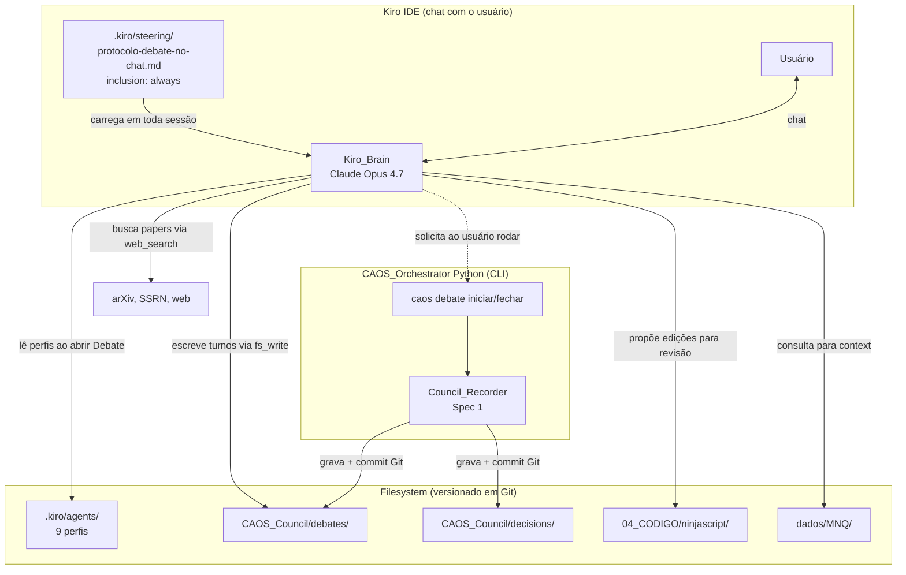

# Design Document

> Spec 5 — Conselho-no-Chat: orquestração autônoma do Conselho CAOS dentro do Kiro IDE

## Overview

A entrega central do Spec 5 é uma **arquitetura de orquestração via steering** em vez de uma arquitetura de orquestração via processo Python externo. O Kiro IDE carrega automaticamente todo arquivo em `.kiro/steering/*.md` que tenha `inclusion: always`. Aproveitamos isso: criamos um steering que descreve, em linguagem natural mas com regras precisas, **como o Kiro_Brain deve se comportar quando algum gatilho acende**.

O resultado é uma camada fina sobre o Spec 1: a infraestrutura de gravação, schemas, máquina de estados, perfis, skills e Council_Recorder permanece intacta. O que muda é **quem produz os turnos e quem decide abrir um Debate**: agora é o Kiro_Brain (Claude Opus 4.7 dentro do chat), guiado pelo steering.

- Overview → seção 1
- Architecture → seção 2
- Components and Interfaces → seção 2
- Data Models → seção 3
- Error Handling → seção 7
- Testing Strategy → seção 8
- Correctness Properties → seção 8

## Architecture



**Princípios arquiteturais:**

1. **Steering como protocolo executável.** O arquivo `.kiro/steering/protocolo-debate-no-chat.md` é o ponto de coordenação central. Por estar com `inclusion: always`, é carregado em toda sessão Kiro automaticamente. Não há "boot" separado: assim que o IDE abre, o Kiro_Brain já está guiado pelas regras.

2. **Um cérebro, nove papéis.** O Kiro_Brain é o mesmo Claude em todos os turnos. A diferenciação acontece pela leitura ativa do perfil em `.kiro/agents/<Agente>.md` antes de cada turno, com adoção de vocabulário, prioridades e formato de saída específicos do papel. Não há "9 LLMs"; há um LLM com 9 prompts.

3. **Devil's Advocate como contraponto formal.** Uma vez que todos os outros 8 perfis são interpretados pelo mesmo cérebro, o risco de groupthink é alto. O Devil's Advocate é o único agente formalmente encarregado de quebrar tese — o steering eleva o rigor desse turno acima dos demais.

4. **Gatilhos de abertura via heurística do Kiro_Brain.** Como não há um daemon Python rodando que monitore eventos, o Kiro_Brain mesmo decide se um gatilho está ativo antes de qualquer ação que produza efeito persistente. O steering lista os 5 gatilhos canônicos com critérios objetivos.

5. **Freios humanos preservados.** O Kiro_Brain pode propor; não pode executar Walk-Forward, não pode instalar no NT8, não pode modificar Decisão commitada. Cada um desses bloqueios é repetido literalmente no steering.

## Components and Interfaces

### `.kiro/steering/protocolo-debate-no-chat.md`

Arquivo Markdown com `inclusion: always` que define:

- **Os 5 gatilhos** com critérios objetivos cada (ex: "alteração em arquivo `04_CODIGO/ninjascript/*.cs` que adicione classe nova" — observável; "alteração de pura formatação ou comentário" — não observável como gatilho).
- **O fluxograma de decisão** que o Kiro_Brain segue antes de qualquer ação:
  ```
  Vou modificar/criar algo?
    ├─ Sim → algum gatilho ativo?
    │        ├─ Sim → abrir Debate_Auto antes
    │        └─ Não → executar direto
    └─ Não → executar direto (ler, listar, explicar não dispara Debate)
  ```
- **O vocabulário de turnos** (cabeçalhos `## Turno N — Agente (FASE)`, blocos `meta` YAML, blocos `Proposta`/`Justificativa`/`Riscos`/`Confianca`).
- **A máquina de estados** (R2 do Spec 1).
- **As regras de veto** (Cerberus e Hermes bloqueiam; Kiro_Brain não pode sobrescrever).
- **Os freios** (NUNCA executar Walk-Forward, NUNCA copiar para NT8, NUNCA editar Decisão commitada).

### `caos debate iniciar <slug>` (CLI Python)

Substitui o stub atual. Gera Debate_Starter em `CAOS_Council/debates/`:

```python
@dataclass
class FlagsDebateIniciar:
    slug: str                    # validado contra ^[a-z0-9-]{1,60}$
    titulo: Optional[str] = None # default: slug com hifens → espaços
    gatilho: str = "usuario"     # um dos 5 gatilhos ou "usuario"
    altera_exposicao: bool = False
    csharp: bool = False
    root: Path = Path.cwd()

def iniciar_debate(flags: FlagsDebateIniciar) -> Path:
    """Cria CAOS_Council/debates/{AAAA-MM-DD}-{NN}-{slug}.md.

    Retorna path absoluto. NN é sequencial dentro do dia, começando em 01.
    O frontmatter YAML é gerado a partir do schema Debate (Spec 1) com
    campos default seguros e fase_final='INICIADO', status='em-andamento'.
    """
```

### `caos debate fechar <identificador>` (CLI Python)

Lê arquivo de Debate, valida estrutura, monta `DecisaoDoConselho`, invoca `CouncilRecorder.gravar`:

```python
@dataclass
class FlagsDebateFechar:
    identificador: str          # AAAA-MM-DD-NN
    dry_run: bool = False
    root: Path = Path.cwd()

def fechar_debate(flags: FlagsDebateFechar) -> ResultadoFechamento:
    """Lê arquivo, valida, gera Decisão, commita.

    Em dry-run, retorna a Decisão derivada sem gravar nem commitar.
    Em modo real, invoca CouncilRecorder.gravar(debate, decisao) que
    cria commit dedicado e Tag_De_Congelamento se aprovado.
    """
```

### Property 21 — Conformidade do Debate gravado

```python
@settings(max_examples=1)  # gate determinístico, não property generativa
@given(st.just(None))
def test_property_debate_no_chat_conformidade(_):
    """Para todo Debate em CAOS_Council/debates/*.md:
       - frontmatter parseia como Debate válido (Pydantic)
       - cada turno tem header "## Turno N — Agente (FASE)" válido
       - sequência de fases respeita máquina de estados
       - Debates CONCLUIDO têm Decisão correspondente
    """
    ...
```

Implementada como teste estático (não generativo) que varre o filesystem; a marca `@given` está ali apenas para ser detectada pelo gate de cobertura `test_property_coverage.py`.

## Data Models

### Frontmatter de Debate_Starter (gerado por `caos debate iniciar`)

```yaml
---
identificador: 2026-05-22-01
titulo: aprimoramento-orb-win-rate
data_inicio: 2026-05-22T18:00:00Z
data_fim: null
agentes_participantes: []      # preenchido durante turnos pelo Kiro_Brain
modelos:
  Athena: claude-opus-4.7
  # demais modelos adicionados conforme participam
contexto_hash_sha256: <SHA-256 do prompt-tema fornecido>
notas_injetadas: []
seeds:
  Athena: 42
orcamento_de_turnos: 12
turnos_consumidos: 0
fase_final: INICIADO
status: em-andamento
gatilho: usuario              # ou um dos 5 canônicos
aberto_por: usuario           # ou "auto"
altera_exposicao: false
requer_csharp: false
---

# <titulo humano>

> Tema: <pequeno parágrafo descrevendo o tema. Preenchido pelo Kiro_Brain quando abre o Debate_Auto.>

## Turno 1 — Athena (INICIADO)
...
```

### Reaproveitamento integral dos modelos do Spec 1

`Debate`, `Turno`, `Proposta`, `Veto`, `DecisaoFinal`, `DecisaoDoConselho`, `NotaPaper` — todos vêm de `caos.models` sem alteração. O Spec 5 só adiciona o **gerador de starter** (Python) e o **leitor/finalizador** (Python), ambos consumindo schemas do Spec 1.

## Loop principal — sob o ponto de vista do Kiro_Brain

```
ao receber qualquer mensagem do usuário:
    1. ler steering protocolo-debate-no-chat.md (já carregado, mas re-checar regras)
    2. classificar a tarefa pretendida:
       - leitura/explicação → executar direto
       - alteração de código fora dos gatilhos → executar direto
       - alteração que casa com algum dos 5 gatilhos → abrir Debate_Auto antes
    3. se Debate_Auto:
       a. anunciar no chat uma linha "[Conselho] abrindo Debate_Auto X (gatilho: Y)"
       b. rodar `caos debate iniciar <slug> --gatilho <Y> [--altera-exposicao] [--csharp]`
       c. ler arquivo gerado, abrir fase INICIADO com turno da Athena
       d. fase PROPOSTAS: round-robin alfabético dos proponentes (Manolo, Mister_M, Odin, Rodrigo, Explorador) com no mínimo 2 propostas válidas
       e. quórum: se < 2 propostas, fechar com SEM_QUORUM
       f. fase CRITICA: turno de Devils_Advocate
       g. fase AVALIACAO_RISCO se altera_exposicao=true: turno de Cerberus
       h. fase AVALIACAO_TECNICA se requer_csharp=true: turno de Hermes
       i. fase SINTESE: turno de Athena com decisão (proposta_aceita, vetos, links_zettel, aprovado_walk_forward)
       j. solicitar ao usuário: "Pronto pra fechar? Roda `caos debate fechar <id>`"
    4. continuar com a tarefa original respeitando a Decisão
```

## Error Handling

| Cenário | Resposta |
|---|---|
| Kiro_Brain abre Debate mas usuário interrompe | Gravar `status: em-pausa` no frontmatter; voltar à conversa |
| Quórum mínimo não atingido (< 2 propostas) | Fechar com `fase_final: SEM_QUORUM`, `status: sem-quorum`, sem Decisão |
| Cerberus emite veto bloqueante | Decisão carrega `vetos: [...]`, `aprovado_walk_forward: false`, `status: pendente-usuario` |
| Hermes detecta API fora da whitelist | Veto técnico bloqueia; Athena na síntese sugere reescrita |
| Usuário roda `caos debate fechar` antes do Debate ter passado por todas as fases obrigatórias | Comando recusa com erro claro listando o que falta |
| Property 21 falha no commit | `caos debate fechar` aborta com diagnóstico |

## Testing Strategy

### Testes unitários (`tests/unit/test_caos_debate_iniciar_fechar.py`)

- `caos debate iniciar` cria arquivo com frontmatter válido para slug, título, gatilho.
- Incremento automático de NN quando arquivo já existe no mesmo dia.
- Validação de slug inválido devolve exit != 0.
- `caos debate fechar` em arquivo malformado devolve erro estruturado.
- `caos debate fechar --dry-run` não grava nada e imprime Decisão derivada.

### Property 21 — Conformidade do Debate gravado

Conforme R5. Implementação estática que varre o filesystem.

## Correctness Properties

### Property 21: Conformidade do Debate-no-Chat

For every file in `CAOS_Council/debates/*.md`:

- The YAML frontmatter SHALL parse as a valid `Debate` (Pydantic schema from Spec 1).
- Each turn SHALL have a header matching `## Turno (\d+) — (Athena|Cerberus|Devils_Advocate|Explorador|Hermes|Manolo|Mister_M|Odin|Rodrigo) \((INICIADO|PROPOSTAS|CRITICA|AVALIACAO_RISCO|AVALIACAO_TECNICA|SINTESE|CONCLUIDO|TIMEOUT|SEM_QUORUM|ABORTADO|PENDENTE_USUARIO|CERBERUS_TIMEOUT)\)`.
- The sequence of phases across turns SHALL be a valid path in the Spec 1 state machine.
- When `fase_final == "CONCLUIDO"`, there SHALL exist a corresponding `Decisao_Do_Conselho` file in `CAOS_Council/decisions/` with the same `identificador`.

**Validates: Requirements 5.1, 5.2**

## Estrutura de Diretórios

```
.kiro/
  steering/
    protocolo-debate-no-chat.md       # NOVO (inclusion: always)
  specs/
    caos-conselho-no-chat/             # NOVO
      requirements.md
      design.md
      tasks.md

CAOS_Orchestrator/
  caos/
    main.py                            # ALTERADO: novo subcomando "debate iniciar/fechar"
    debate_io.py                       # NOVO: helpers para gerar starter / fechar
  tests/
    unit/
      test_caos_debate_iniciar_fechar.py  # NOVO
    property/
      test_debate_no_chat_conformidade.py # NOVO (Property 21)

CAOS_Council/
  debates/
    AAAA-MM-DD-NN-{slug}.md            # gerados por `caos debate iniciar` ou pelo Kiro_Brain
  decisions/
    AAAA-MM-DD-NN-{slug}.md            # gerados por `caos debate fechar`
```
