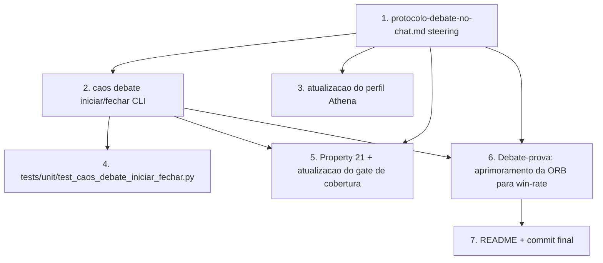

# Implementation Plan

> Spec 5 — Conselho-no-Chat: orquestração autônoma do Conselho dentro do Kiro IDE

## Overview

7 tarefas que entregam o Conselho funcionando dentro do chat sem dependência de API externa. Idioma pt-BR; plataforma Windows + cmd para o CLI. A arquitetura central é o steering em `.kiro/steering/protocolo-debate-no-chat.md` com `inclusion: always` que carrega a cada sessão e guia o Kiro_Brain.

## Task Dependency Graph



```json
{
  "waves": [
    {"wave": 1, "tasks": ["1"]},
    {"wave": 2, "tasks": ["2", "3"]},
    {"wave": 3, "tasks": ["4", "5"]},
    {"wave": 4, "tasks": ["6"]},
    {"wave": 5, "tasks": ["7"]}
  ],
  "dependencies": {
    "1": [],
    "2": ["1"],
    "3": ["1"],
    "4": ["2"],
    "5": ["1", "2"],
    "6": ["1", "2"],
    "7": ["6"]
  }
}
```

## Tasks

- [ ] 1. `.kiro/steering/protocolo-debate-no-chat.md` (inclusion: always)
  - Frontmatter `inclusion: always`.
  - Seção "Identidade do Conselho" — quem são os 9 papéis e qual o cérebro único.
  - Seção "5 Gatilhos canônicos" — critérios objetivos para abertura automática (R2.1 do requirements).
  - Seção "Fluxograma de decisão antes de qualquer ação" — em pseudocódigo Markdown.
  - Seção "Vocabulário de turno" — formato exato dos cabeçalhos `## Turno N — Agente (FASE)` e blocos `meta`/`Proposta`.
  - Seção "Máquina de estados" (referência ao Spec 1).
  - Seção "Vetos bloqueantes" — Cerberus e Hermes não podem ser sobrescritos.
  - Seção "Freios humanos" — NUNCA executar Walk-Forward, NUNCA copiar para NT8, NUNCA editar Decisão commitada.
  - Seção "Como abrir e fechar Debate" — passo-a-passo.
  - **Cobre**: R1, R8.

- [ ] 2. `caos debate iniciar` e `caos debate fechar` (CLI Python)
  - `caos/debate_io.py`: módulo com `iniciar_debate(flags) -> Path`, `fechar_debate(flags) -> ResultadoFechamento`.
  - `caos/main.py`: substituir o subcomando `debate <tema>` (stub) por subgrupo `debate {iniciar,fechar}` com flags do design.
  - Testes via subprocess no mesmo padrão do Spec 2.
  - **Cobre**: R3, R4.

- [ ] 3. Atualizar `.kiro/agents/Athena.md`
  - Adicionar seção curta "Modo de execução: Kiro_Brain interpreta Athena dentro do chat (Spec 5)".
  - Garantir que `caos perfil validar Athena` continua passando.
  - **Cobre**: R6.

- [ ] 4. `tests/unit/test_caos_debate_iniciar_fechar.py`
  - Cenários: criar starter; rejeitar slug inválido; incrementar NN; --dry-run não grava; fechar com Debate malformado falha; fechar com Debate completo gera Decisão e commit.
  - **Cobre**: R3, R4.

- [ ] 5. `tests/property/test_debate_no_chat_conformidade.py` — Property 21
  - Teste estático que varre `CAOS_Council/debates/*.md` validando frontmatter, headers de turno, sequência de fases, existência de Decisão correspondente.
  - Atualizar `tests/property/test_property_coverage.py` com Property 21 e spec `caos-conselho-no-chat: (21,)`.
  - **Cobre**: R5.

- [ ] 6. Debate-prova: "Como aprimorar a estratégia ORB para visar 55-65% de win rate"
  - Kiro_Brain conduz o Debate de ponta a ponta dentro do chat.
  - Explorador busca pelo menos 1 paper real via web_search.
  - Mister_M, Manolo, Odin propõem variantes distintas.
  - Devils_Advocate ataca cada proposta.
  - Cerberus avalia (altera_exposicao=true porque variantes mudam parâmetros de risco).
  - Hermes valida (requer_csharp=false porque é apenas tuning Python).
  - Athena sintetiza e marca aprovado_walk_forward conforme Decisão.
  - Usuário roda `caos debate fechar <id>`.
  - **Cobre**: R7.

- [ ] 7. README atualizado + commit final
  - README mestre da raiz: nova seção "Conselho-no-Chat" explicando o protocolo de gatilhos automáticos e os 5 freios humanos.
  - `04_CODIGO/ninjascript/README.md`: nada muda (Spec 5 não toca C#).
  - Commit Git dedicado.
  - **Cobre**: R8.

## Notes

- O Spec 5 **não** introduz nenhuma dependência externa — sem API key, sem provedor LLM. O cérebro é o Kiro IDE rodando Claude Opus 4.7 que você já paga.
- O Property 21 funciona como gate de auditabilidade: rejeita Debates malformados antes do commit. É o equivalente do "compilador para Debates".
- A trava operacional contra danos é o conjunto de freios em R8: Walk-Forward só roda se você executar; nada é copiado para NT8 sem você; Decisão commitada é imutável.
- Quando o protocolo Spec 5 não cobrir algum cenário (raro), o Kiro_Brain deve perguntar ao usuário antes de improvisar — coerente com o R8.4 ("antes de começar os turnos, anunciar o que vai fazer").
