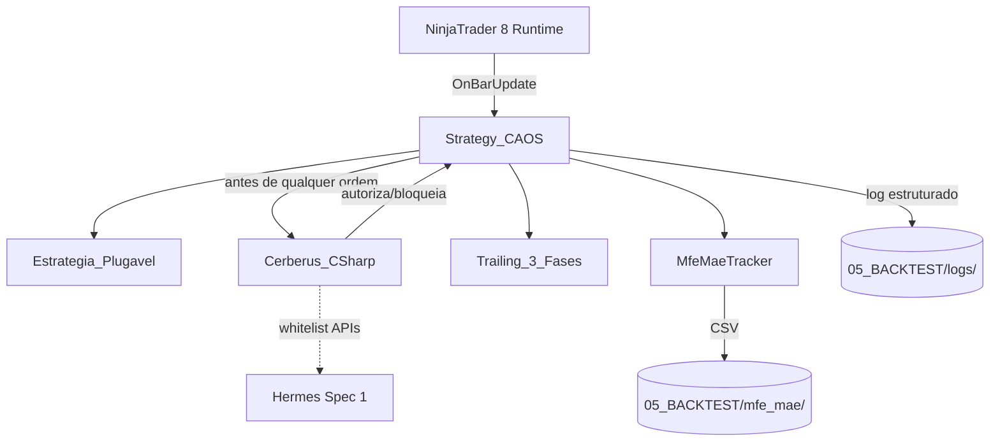
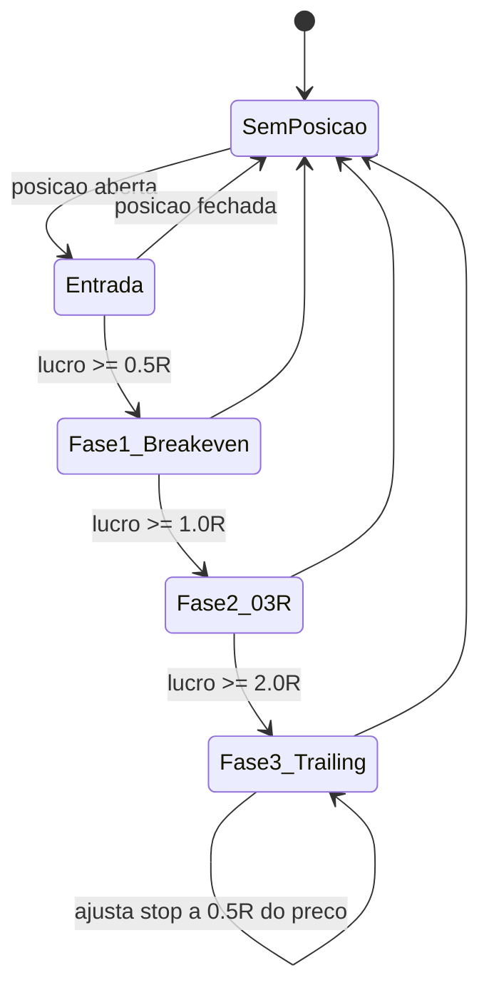

# Design Document

> Spec 3 — Núcleo do Robô C# (NinjaScript base)

## Overview

O núcleo C# entrega 4 componentes principais — `Strategy_CAOS`, `Cerberus_CSharp`, `Trailing_3_Fases`, `MfeMaeTracker` — em um projeto MSBuild compilável pelo `Skill_MSBuild` do Spec 1. As estratégias plugáveis dos Specs 4+ herdam de `Strategy_CAOS` e expõem apenas a lógica de sinal, deixando ciclo de vida, risco e instrumentação para o núcleo.

- Overview → seção 1
- Architecture → seção 2
- Components and Interfaces → seção 2
- Data Models → seção 3
- Error Handling → seção 7
- Testing Strategy → seção 8
- Correctness Properties → seção 8

## Architecture



## Components and Interfaces

### `Strategy_CAOS` (classe base abstrata)

```csharp
public abstract class Strategy_CAOS : NinjaTrader.NinjaScript.Strategies.Strategy
{
    protected Cerberus_CSharp Cerberus { get; private set; }
    protected Trailing_3_Fases Trailing { get; private set; }
    protected MfeMaeTracker MfeMae { get; private set; }

    [NinjaScriptProperty, Range(1, 10)]
    public int MaxContratos { get; set; } = 1;

    [NinjaScriptProperty, Range(50, 5000)]
    public double CircuitBreakerDiarioUSD { get; set; } = 500;

    [NinjaScriptProperty, Range(0.0, 2.0)]
    public double TrailingFase1Multiplicador { get; set; } = 0.5;

    [NinjaScriptProperty, Range(0.0, 2.0)]
    public double TrailingFase2Multiplicador { get; set; } = 1.0;

    [NinjaScriptProperty, Range(0.0, 2.0)]
    public double TrailingFase3Multiplicador { get; set; } = 2.0;

    protected override void OnStateChange()
    {
        switch (State)
        {
            case State.SetDefaults: ConfigureDefaults(); break;
            case State.Configure: ConfigureBars(); break;
            case State.DataLoaded: InstanciarComponentes(); break;
            case State.Historical: ResetarEstatisticasDiarias(); break;
            case State.Realtime: VerificarConta(); break;
        }
    }

    protected override void OnBarUpdate()
    {
        if (CurrentBars[0] < 0) return;
        OnNovaBarra();                                 // hook estratégia filha
        Trailing.Atualizar(GetCurrentAsk(), GetCurrentBid(), Position);
        MfeMae.AtualizarPosicaoCorrente(Close[0], Position);
    }

    protected virtual void OnNovaBarra() { }
    protected virtual void OnSinalEntrada(...) { }
    protected virtual void OnSinalSaida(...) { }

    // Wrapper que TODA estratégia filha deve usar — não chamar EnterLong direto.
    protected bool EntrarLong(int contratos, double stopLossPreco, double takeProfitPreco, string sinal)
    {
        if (State == State.Historical) return SimularEntrada(...);
        if (!Cerberus.AutorizarEntrada(contratos, RiscoUSD(stopLossPreco))) return false;
        EnterLong(contratos, sinal);
        SetStopLoss(sinal, CalculationMode.Price, stopLossPreco, false);
        SetProfitTarget(sinal, CalculationMode.Price, takeProfitPreco);
        return true;
    }

    // Análogo: EntrarShort, SairLong, SairShort.
}
```

### `Cerberus_CSharp`

```csharp
public class Cerberus_CSharp
{
    private readonly int maxContratos;
    private readonly double circuitBreakerUSD;
    private double pnlDiarioRealizado = 0;
    private bool circuitBreakerAtivado = false;
    private DateTime diaCorrente;

    public bool AutorizarEntrada(int contratos, double riscoUSD) {
        if (circuitBreakerAtivado) return false;
        if (contratos > maxContratos) return false;
        if (riscoUSD <= 0) return false;
        // Verificações adicionais (margens disponíveis, etc.) ficam aqui.
        return true;
    }

    public void RegistrarPnlRealizado(double pnl) {
        if (DateTime.UtcNow.Date != diaCorrente) ResetarDia();
        pnlDiarioRealizado += pnl;
        if (pnlDiarioRealizado <= -circuitBreakerUSD) {
            circuitBreakerAtivado = true;
            // Sinaliza Strategy_CAOS para fechar posição e bloquear novas entradas.
        }
    }

    public bool CircuitBreakerAtivo => circuitBreakerAtivado;
}
```

### `Trailing_3_Fases`

Máquina de 3 estados:



Cada transição emite log estruturado e chama `SetStopLoss(...)` no NinjaTrader.

### `MfeMaeTracker`

- Mantém `mfe`, `mae` por posição aberta.
- Em fechamento, chama `EscreverLinhaCSV(...)`.
- Usa `StreamWriter` em modo `append` com flush por linha (idempotência sob crash).

## Data Models

### Schema do CSV de MFE/MAE
```
id_trade,entrada_timestamp,saida_timestamp,direcao,mfe_ticks,mae_ticks,pnl_usd
1,2025-01-02T13:32:00Z,2025-01-02T13:48:00Z,LONG,12,-3,24.00
```

### Schema do log estruturado
```
2025-01-02T13:32:00Z INFO entrada_autorizada {"contratos":1,"sinal":"ORB","preco":21500.25,"risco_usd":40.00}
2025-01-02T13:35:00Z INFO trailing_fase_1 {"trade_id":1,"stop_novo":21500.25,"motivo":"breakeven"}
2025-01-02T14:10:00Z WARN circuit_breaker_ativado {"pnl_dia":-505.50}
```

## Loop principal (resumo)

1. `OnStateChange` instancia componentes em `State.DataLoaded`.
2. `OnBarUpdate` invoca `OnNovaBarra` da estratégia filha.
3. Estratégia filha decide entrada e chama `EntrarLong/EntrarShort` da base — nunca `EnterLong` direto.
4. Base consulta `Cerberus.AutorizarEntrada` antes de enviar.
5. `Trailing_3_Fases` atualiza stop a cada barra.
6. `MfeMaeTracker` registra MFE/MAE por barra; flusha CSV no fechamento.

## Error Handling

| Cenário | Resposta |
|---|---|
| `State.Historical` mas `EnterLong` chamado | Bloquear; logar no Output Window |
| Cerberus bloqueia entrada | Retornar `false` para estratégia, logar com motivo |
| Circuit Breaker ativado | Fechar posição via `ExitLong/ExitShort`, bloquear novas |
| Falha ao escrever CSV/log | Fallback para `Print()` no Output |
| Conta ativa não é Sim101 | Avisos repetidos no Output Window |

## Testing Strategy

### Testes de unidade (NUnit, sem NT8)

- `Cerberus_CSharp`: bloqueia contratos > max, ativa Circuit Breaker no limite, reseta no rollover de dia.
- `Trailing_3_Fases`: transita corretamente entre fases dado série de preços.
- `MfeMaeTracker`: calcula MFE/MAE corretamente em série sintética.

### Correctness Properties

#### Property 16: Cerberus C# Soundness
For every entry attempt with `contratos > MaxContratos` OR `riscoUSD > circuit_breaker_remaining`, `Cerberus_CSharp.AutorizarEntrada` SHALL return `false`.

**Validates: Requirements 3.1, 3.2**

#### Property 17: Trailing Monotonia
For every active position, the stop loss SHALL never move against the trade direction (LONG: stop nunca desce; SHORT: stop nunca sobe).

**Validates: Requirements 4.1, 4.2, 4.3**

#### Property 18: Estado Histórico Sem Ordens Reais
For every `OnBarUpdate` invocation in `State.Historical`, no real `EnterLong`/`EnterShort` SHALL be issued (verificado por logs).

**Validates: Requirements 2.3**

### Integração com Hermes (Spec 1)

A cada commit que toque em `04_CODIGO/ninjascript/`, o Conselho convoca Hermes que invoca `Skill_MSBuild`. Compilação com 0 erros é pré-requisito de aceitação.

## Estrutura de Diretórios

```
04_CODIGO/
  ninjascript/
    CAOS.csproj
    Strategy.cs           # Strategy_CAOS
    Cerberus.cs
    TrailingTresFases.cs
    MfeMaeTracker.cs
    Helpers/
  ninjascript_tests/
    CAOS.Tests.csproj
    Cerberus_Tests.cs
    Trailing_Tests.cs
    MfeMae_Tests.cs

05_BACKTEST/
  mfe_mae/                # CSVs por dia/estratégia
  logs/                   # logs estruturados
```
