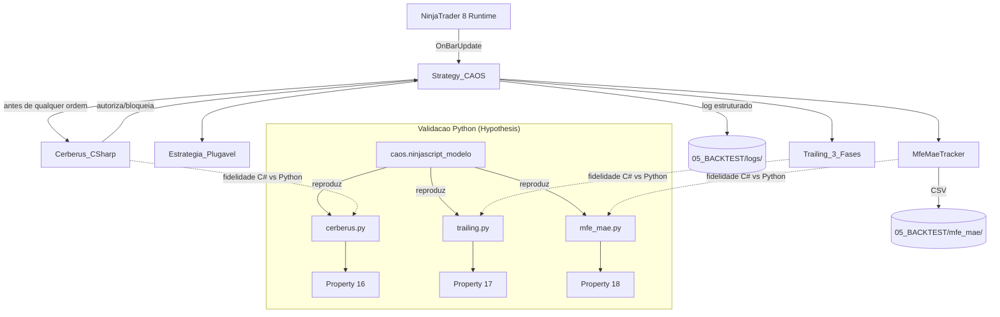
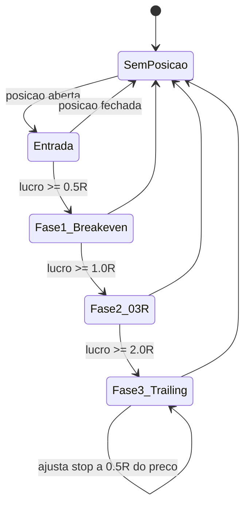

# Design Document

> Spec 3 — Núcleo do Robô C# (NinjaScript base)

## Overview

O núcleo C# entrega 4 componentes principais — `Strategy_CAOS`, `Cerberus_CSharp`, `Trailing_3_Fases`, `MfeMaeTracker` — em arquivos `.cs` autossuficientes que o usuário copia para `%USERPROFILE%\Documents\NinjaTrader 8\bin\Custom\Strategies\` e compila via F5 dentro do NinjaScript Editor. Não há `.csproj` próprio, MSBuild externo nem Visual Studio no escopo deste spec.

As estratégias plugáveis dos Specs 4+ herdam de `Strategy_CAOS` e expõem apenas a lógica de sinal, deixando ciclo de vida, risco e instrumentação para o núcleo.

A validação automatizada (Properties 16, 17, 18) acontece em Python via Hypothesis sobre uma reimplementação fiel da lógica pura no pacote `caos.ninjascript_modelo`. Qualquer divergência entre C# e Python é tratada como veto técnico — o C# é a fonte da verdade operacional, mas o Python é a fonte da verdade de correção semântica.

- Overview → seção 1
- Architecture → seção 2
- Components and Interfaces → seção 2
- Data Models → seção 3
- Error Handling → seção 7
- Testing Strategy → seção 8
- Correctness Properties → seção 8

## Architecture



## Components and Interfaces

### `Strategy_CAOS` (classe base abstrata)

```csharp
namespace NinjaTrader.NinjaScript.Strategies.CAOS
{
    public abstract class Strategy_CAOS : Strategy
    {
        protected Cerberus_CSharp Cerberus { get; private set; }
        protected Trailing_3_Fases Trailing { get; private set; }
        protected MfeMaeTracker MfeMae { get; private set; }

        [NinjaScriptProperty, Range(1, 10)]
        public int MaxContratos { get; set; } = 1;

        [NinjaScriptProperty, Range(50, 5000)]
        public double CircuitBreakerDiarioUSD { get; set; } = 500;

        [NinjaScriptProperty, Range(0.0, 2.0)]
        public double TrailingFase1Multiplicador { get; set; } = 0.5;

        [NinjaScriptProperty, Range(0.0, 2.0)]
        public double TrailingFase2Multiplicador { get; set; } = 1.0;

        [NinjaScriptProperty, Range(0.0, 2.0)]
        public double TrailingFase3Multiplicador { get; set; } = 2.0;

        [NinjaScriptProperty]
        public string CaosWorkspaceRoot { get; set; } = "";  // se vazio, usa %USERPROFILE%\CAOS

        protected override void OnStateChange()
        {
            switch (State)
            {
                case State.SetDefaults: ConfigureDefaults(); break;
                case State.Configure: ConfigureBars(); break;
                case State.DataLoaded: InstanciarComponentes(); break;
                case State.Historical: ResetarEstatisticasDiarias(); break;
                case State.Realtime: VerificarConta(); break;
            }
        }

        protected override void OnBarUpdate()
        {
            if (CurrentBars[0] < 0) return;
            OnNovaBarra();                                 // hook estratégia filha
            Trailing.Atualizar(GetCurrentAsk(), GetCurrentBid(), Position);
            MfeMae.AtualizarPosicaoCorrente(Close[0], Position);
        }

        protected virtual void OnNovaBarra() { }
        protected virtual void OnSinalEntrada() { }
        protected virtual void OnSinalSaida() { }

        // Wrapper que TODA estratégia filha deve usar — não chamar EnterLong direto.
        protected bool EntrarLong(int contratos, double stopLossPreco, double takeProfitPreco, string sinal)
        {
            if (State == State.Historical) return SimularEntrada(contratos, stopLossPreco, takeProfitPreco, sinal);
            double riscoUSD = CalcularRiscoUSD(stopLossPreco);
            if (!Cerberus.AutorizarEntrada(contratos, riscoUSD)) return false;
            EnterLong(contratos, sinal);
            SetStopLoss(sinal, CalculationMode.Price, stopLossPreco, false);
            SetProfitTarget(sinal, CalculationMode.Price, takeProfitPreco);
            return true;
        }

        // Análogo: EntrarShort, SairLong, SairShort.
    }
}
```

### `Cerberus_CSharp`

```csharp
namespace NinjaTrader.NinjaScript.Strategies.CAOS
{
    public class Cerberus_CSharp
    {
        private readonly int maxContratos;
        private readonly double circuitBreakerUSD;
        private double pnlDiarioRealizado = 0;
        private bool circuitBreakerAtivado = false;
        private DateTime diaCorrente = DateTime.UtcNow.Date;

        public Cerberus_CSharp(int maxContratos, double circuitBreakerUSD)
        {
            this.maxContratos = maxContratos;
            this.circuitBreakerUSD = circuitBreakerUSD;
        }

        public bool AutorizarEntrada(int contratos, double riscoUSD)
        {
            VerificarRolloverDia();
            if (circuitBreakerAtivado) return false;
            if (contratos < 1 || contratos > maxContratos) return false;
            if (riscoUSD <= 0) return false;
            return true;
        }

        public void RegistrarPnlRealizado(double pnl)
        {
            VerificarRolloverDia();
            pnlDiarioRealizado += pnl;
            if (pnlDiarioRealizado <= -circuitBreakerUSD)
                circuitBreakerAtivado = true;
        }

        private void VerificarRolloverDia()
        {
            DateTime hoje = DateTime.UtcNow.Date;
            if (hoje != diaCorrente)
            {
                diaCorrente = hoje;
                pnlDiarioRealizado = 0;
                circuitBreakerAtivado = false;
            }
        }

        public bool CircuitBreakerAtivo => circuitBreakerAtivado;
        public double PnlDiarioRealizado => pnlDiarioRealizado;
    }
}
```

### `Trailing_3_Fases`

Máquina de 3 estados:



Cada transição emite log estruturado e chama `SetStopLoss(...)` no NinjaTrader. Invariante crítica (Property 17): para LONG, `stop_novo >= stop_anterior`; para SHORT, `stop_novo <= stop_anterior`.

### `MfeMaeTracker`

- Mantém `mfe`, `mae` por posição aberta; `mfe >= 0` sempre, `mae <= 0` sempre (Property 18).
- Em fechamento, chama `EscreverLinhaCSV(...)`.
- Usa `StreamWriter` em modo `append` com flush por linha (idempotência sob crash).

## Data Models

### Schema do CSV de MFE/MAE
```
id_trade,entrada_timestamp,saida_timestamp,direcao,mfe_ticks,mae_ticks,pnl_usd
1,2025-01-02T13:32:00Z,2025-01-02T13:48:00Z,LONG,12,-3,24.00
```

### Schema do log estruturado
```
2025-01-02T13:32:00Z INFO entrada_autorizada {"contratos":1,"sinal":"ORB","preco":21500.25,"risco_usd":40.00}
2025-01-02T13:35:00Z INFO trailing_fase_1 {"trade_id":1,"stop_novo":21500.25,"motivo":"breakeven"}
2025-01-02T14:10:00Z WARN circuit_breaker_ativado {"pnl_dia":-505.50}
```

### Pacote Python `caos.ninjascript_modelo` — espelho de correção semântica

Cada módulo é um arquivo Python puro (sem dependências do NT8) que reimplementa **a lógica decisória** dos componentes C#. Não tem cobertura de I/O nem de APIs do NinjaScript — apenas as regras de decisão. As assinaturas e nomes de campo são deliberadamente análogos aos do C# para que qualquer divergência futura seja imediatamente óbvia em code-review.

```python
# caos/ninjascript_modelo/cerberus.py
class CerberusModelo:
    def __init__(self, max_contratos: int, circuit_breaker_usd: float): ...
    def autorizar_entrada(self, contratos: int, risco_usd: float) -> bool: ...
    def registrar_pnl_realizado(self, pnl: float) -> None: ...
    def rollover_dia(self) -> None: ...

# caos/ninjascript_modelo/trailing.py
class TrailingModelo:
    def __init__(self, fase1_mult: float, fase2_mult: float, fase3_mult: float, tick_size: float = 0.25): ...
    def abrir_long(self, entrada: float, stop_inicial: float) -> None: ...
    def abrir_short(self, entrada: float, stop_inicial: float) -> None: ...
    def atualizar(self, preco_atual: float) -> float:  # devolve novo stop
        ...
    def fechar(self) -> None: ...

# caos/ninjascript_modelo/mfe_mae.py
@dataclass
class TradeMfeMae:
    id_trade: int
    direcao: str  # "LONG" | "SHORT"
    entrada_preco: float
    mfe_ticks: int = 0
    mae_ticks: int = 0

class MfeMaeModelo:
    def __init__(self, tick_size: float = 0.25): ...
    def abrir(self, id_trade: int, direcao: str, entrada_preco: float) -> None: ...
    def atualizar(self, preco_atual: float) -> None: ...
    def fechar(self, saida_preco: float) -> TradeMfeMae: ...
```

## Loop principal (resumo)

1. `OnStateChange` instancia componentes em `State.DataLoaded`.
2. `OnBarUpdate` invoca `OnNovaBarra` da estratégia filha.
3. Estratégia filha decide entrada e chama `EntrarLong/EntrarShort` da base — nunca `EnterLong` direto.
4. Base consulta `Cerberus.AutorizarEntrada` antes de enviar.
5. `Trailing_3_Fases` atualiza stop a cada barra.
6. `MfeMaeTracker` registra MFE/MAE por barra; flusha CSV no fechamento.

## Error Handling

| Cenário | Resposta |
|---|---|
| `State.Historical` mas `EnterLong` chamado | Bloquear; logar no Output Window |
| Cerberus bloqueia entrada | Retornar `false` para estratégia, logar com motivo |
| Circuit Breaker ativado | Fechar posição via `ExitLong/ExitShort`, bloquear novas |
| Falha ao escrever CSV/log | Fallback para `Print()` no Output |
| Conta ativa não é Sim101 | Avisos repetidos no Output Window |

## Testing Strategy

### Validação manual no NT8 (caminho operacional)

- Copiar os `.cs` para `%USERPROFILE%\Documents\NinjaTrader 8\bin\Custom\Strategies\`.
- Abrir o NinjaScript Editor (Tools → Edit NinjaScript → Strategy).
- Pressionar F5 → compilação deve completar sem erros.
- Adicionar uma estratégia filha mínima (que herde de `Strategy_CAOS` e implemente `OnSinalEntrada`) para teste em `Sim101`.

### Validação automatizada (Properties 16, 17, 18 em Python)

Cada Property exercita o modelo Python em `caos.ninjascript_modelo` via Hypothesis. Como o modelo Python é uma reimplementação fiel do C#, qualquer falha de Property também aponta para um bug no C# correspondente. Definições formais ficam na seção `## Correctness Properties` abaixo.

## Correctness Properties

### Property 16: Cerberus C# Soundness

For every entry attempt, `CerberusModelo.autorizar_entrada(contratos, risco_usd)` SHALL return `False` whenever `contratos < 1` OR `contratos > max_contratos` OR `risco_usd <= 0` OR the circuit breaker is active.

**Validates: Requirements 3.1, 3.2, 3.5**

Strategy: gera tuplas `(max_contratos, circuit_breaker_usd, contratos, risco_usd, pnl_realizado_acumulado)` e valida que o resultado de `autorizar_entrada` casa com a regra de decisão pura. Cobre rollover de dia injetando datas distintas em `rollover_dia()`.

### Property 17: Trailing Monotonia

For every active position, the stop loss SHALL never move against the trade direction (LONG: stop nunca desce; SHORT: stop nunca sobe).

**Validates: Requirements 4.1, 4.2, 4.3, 4.5**

Strategy: gera série de preços + parâmetros de fase, abre posição, itera `atualizar(preco)` várias vezes; verifica que `stop_novo >= stop_anterior` (LONG) ou `stop_novo <= stop_anterior` (SHORT) em todos os passos.

### Property 18: MFE/MAE Convenção e Não-Negatividade

For every closed trade emitted by `MfeMaeModelo.fechar(...)`, `mfe_ticks >= 0` AND `mae_ticks <= 0` AND `|mfe| + |mae| >= |saida_preco - entrada_preco|` (nem MFE nem MAE podem ser menores que a excursão final efetiva, em magnitude).

**Validates: Requirements 5.1, 5.4**

Strategy: gera série de preços, abre trade, atualiza com cada preço, fecha; valida convenções de sinal e cota mínima.

## Integração com Hermes (Spec 1)

A cada commit que toque em `04_CODIGO/ninjascript/`, o Conselho convoca Hermes que:
1. Lê o whitelist em `.kiro/steering/ninjascript-api.md`.
2. Faz busca textual nos `.cs` e veta qualquer símbolo fora da whitelist.
3. Roda `pytest tests/property/test_ninjascript_*.py` — falhas viram veto técnico (Property 16/17/18).

Skill_MSBuild **não** é mais usada para o núcleo do Spec 3 (decisão deste spec — o NT8 é o compilador canônico).

## Estrutura de Diretórios

```
04_CODIGO/
  ninjascript/
    Strategy.cs           # Strategy_CAOS
    Cerberus.cs
    TrailingTresFases.cs
    MfeMaeTracker.cs
    Logger.cs
    README.md             # passo-a-passo de instalação no NT8

CAOS_Orchestrator/
  caos/
    ninjascript_modelo/   # espelho Python das decisões puras
      __init__.py
      cerberus.py
      trailing.py
      mfe_mae.py
  tests/
    property/
      test_ninjascript_cerberus.py    # Property 16
      test_ninjascript_trailing.py    # Property 17
      test_ninjascript_mfe_mae.py     # Property 18

05_BACKTEST/
  mfe_mae/                # CSVs por dia/estratégia
  logs/                   # logs estruturados
```
