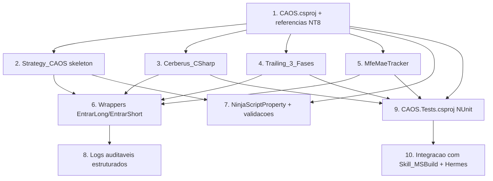

# Implementation Plan

> Spec 3 — Núcleo do Robô C# (NinjaScript base)

## Overview

10 tarefas que entregam o núcleo C# pronto para receber estratégias plugáveis dos Specs 4+. Idioma pt-BR; plataforma Windows + NT8 + MSBuild; integra com `Skill_MSBuild` do Spec 1.

**Pré-requisitos operacionais:**
- NinjaTrader 8 instalado.
- Variável de ambiente `NT8_REFERENCES` apontando para `C:\Program Files\NinjaTrader 8\bin\Custom\` (ou onde estiverem `NinjaTrader.Custom.dll` e `NinjaTrader.Core.dll`).
- `dotnet` SDK instalado para compilação via CLI fora do NT8.

## Task Dependency Graph



```json
{
  "waves": [
    {"wave": 1, "tasks": ["1"]},
    {"wave": 2, "tasks": ["2", "3", "4", "5"]},
    {"wave": 3, "tasks": ["6", "7", "9"]},
    {"wave": 4, "tasks": ["8", "10"]}
  ],
  "dependencies": {
    "1": [],
    "2": ["1"],
    "3": ["1"],
    "4": ["1"],
    "5": ["1"],
    "6": ["2", "3", "4", "5"],
    "7": ["1", "2"],
    "8": ["6"],
    "9": ["1", "3", "4", "5"],
    "10": ["9"]
  }
}
```

## Tasks

- [ ] 1. `CAOS.csproj` em `04_CODIGO/ninjascript/`
  - Target framework: `net48` (compatível NT8).
  - References: `NinjaTrader.Custom.dll`, `NinjaTrader.Core.dll`, `System`, `System.Core`, `System.Data`, `System.Drawing`, `System.Xml`.
  - Variável `NT8_REFERENCES` para path das DLLs.
  - Validar que `Skill_MSBuild` (Spec 1) compila com 0 erros sem o NT8 rodando.
  - **Cobre**: R1, R9.

- [ ] 2. `Strategy.cs` — esqueleto de `Strategy_CAOS`
  - Classe abstrata herdando `NinjaTrader.NinjaScript.Strategies.Strategy`.
  - `OnStateChange()` cobrindo os 5 estados.
  - Hooks virtuais `OnNovaBarra`, `OnSinalEntrada`, `OnSinalSaida`.
  - **Cobre**: R2.

- [ ] 3. `Cerberus.cs` — gestão de risco
  - `AutorizarEntrada(contratos, riscoUSD)` com lógica completa.
  - `RegistrarPnlRealizado(pnl)` + `Circuit_Breaker_Diario`.
  - Reset diário em rollover.
  - **Cobre**: R3.

- [ ] 4. `TrailingTresFases.cs` — máquina de 3 fases
  - Estado `SemPosicao → Entrada → Fase1 → Fase2 → Fase3 → SemPosicao`.
  - `Atualizar(ask, bid, position)` chamado a cada barra.
  - **Cobre**: R4.

- [ ] 5. `MfeMaeTracker.cs` — instrumentação
  - Acompanha `mfe_atual`/`mae_atual` por trade.
  - Escreve CSV em `05_BACKTEST/mfe_mae/AAAA-MM-DD-strategia.csv`.
  - **Cobre**: R5.

- [ ] 6. Wrappers `EntrarLong/EntrarShort/SairLong/SairShort` em `Strategy_CAOS`
  - Toda estratégia filha DEVE usar; nunca `EnterLong` direto.
  - Roteia por `Cerberus.AutorizarEntrada` antes do envio.
  - Bloqueia ordens reais em `State.Historical`.
  - **Cobre**: R2.3, R2.4, R3.3.

- [ ] 7. `[NinjaScriptProperty]` + validações de range
  - `MaxContratos`, `CircuitBreakerDiarioUSD`, `TrailingFaseN_Multiplicador`.
  - Atributos `[Range(...)]`.
  - **Cobre**: R6.

- [ ] 8. Logs auditáveis estruturados
  - Helper `Logger.cs` que grava em `05_BACKTEST/logs/AAAA-MM-DD-{strategia}.log`.
  - Formato: `<timestamp> <NIVEL> <evento> <payload-json>`.
  - Fallback para `Print(...)` em falha de I/O.
  - **Cobre**: R7.

- [ ] 9. `CAOS.Tests.csproj` (NUnit)
  - Target `net48`, NUnit 3.x.
  - Testes para `Cerberus_CSharp`, `Trailing_3_Fases`, `MfeMaeTracker`.
  - PBT em C# via FsCheck (opcional) — Properties 16, 17, 18.
  - **Cobre**: R10, Properties 16/17/18.

- [ ] 10. Integração com `Skill_MSBuild` e Hermes
  - Atualizar `.kiro/steering/ninjascript-api.md` com qualquer API nova usada.
  - Validar que Hermes (Spec 1) consegue compilar e rejeita PRs sem 0/0 erros/warnings.
  - Documentar fluxo no `README.md` do `04_CODIGO/ninjascript/`.
  - **Cobre**: R1.3, R9.

## Notes

- **NÃO** implementar lógica de entrada concreta aqui; isso é Spec 4+.
- **`Sim101`** é a conta de teste padrão; `Sim100` ou contas reais geram avisos repetidos no Output (R8.3).
- Versão do NT8 alvo: 8.x (Lifetime Edition); validar que `NinjaTrader.Custom.dll` está acessível.
- O `dotnet test` precisa ser invocado com `/p:NT8_REFERENCES=...` para encontrar as DLLs.
