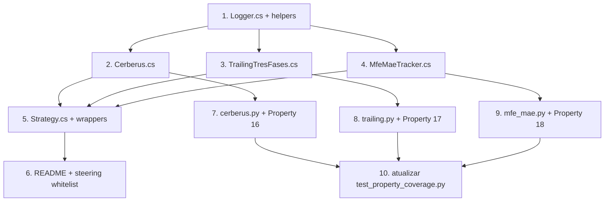

# Implementation Plan

> Spec 3 — Núcleo do Robô C# (NinjaScript base)

## Overview

7 tarefas que entregam o núcleo C# pronto para receber estratégias plugáveis dos Specs 4+. Idioma pt-BR; plataforma Windows + NT8 (NinjaScript Editor compila via F5). Validação automatizada via Properties 16/17/18 em Python (Hypothesis), sem dependência de MSBuild externo, dotnet SDK ou Visual Studio.

**Pré-requisitos operacionais:**
- NinjaTrader 8 instalado em `%USERPROFILE%\Documents\NinjaTrader 8\` (estrutura padrão).
- Python 3.11+ com Hypothesis (já em `pyproject.toml` do Spec 1).

## Task Dependency Graph



```json
{
  "waves": [
    {"wave": 1, "tasks": ["1"]},
    {"wave": 2, "tasks": ["2", "3", "4"]},
    {"wave": 3, "tasks": ["5", "7", "8", "9"]},
    {"wave": 4, "tasks": ["6", "10"]}
  ],
  "dependencies": {
    "1": [],
    "2": ["1"],
    "3": ["1"],
    "4": ["1"],
    "5": ["2", "3", "4"],
    "6": ["5"],
    "7": ["2"],
    "8": ["3"],
    "9": ["4"],
    "10": ["7", "8", "9"]
  }
}
```

## Tasks

- [ ] 1. `Logger.cs` em `04_CODIGO/ninjascript/`
  - Helper estático `Logger` que escreve em `<workspace>/05_BACKTEST/logs/AAAA-MM-DD-{strategia}.log`.
  - Formato `<timestamp ISO 8601 UTC> <NIVEL> <evento> <payload-json>`.
  - Fallback para `Print(...)` (NinjaScript) em qualquer falha de I/O — método aceita `Action<string>` opcional para o callback do `Print`.
  - Namespace `NinjaTrader.NinjaScript.Strategies.CAOS`.
  - **Cobre**: R1, R7.

- [ ] 2. `Cerberus.cs` em `04_CODIGO/ninjascript/`
  - Classe `Cerberus_CSharp` com construtor `(int maxContratos, double circuitBreakerUSD)`.
  - `bool AutorizarEntrada(int contratos, double riscoUSD)`.
  - `void RegistrarPnlRealizado(double pnl)` + rollover diário (UTC).
  - Property `bool CircuitBreakerAtivo` e `double PnlDiarioRealizado`.
  - Sem dependências do NinjaScript runtime (classe pura).
  - **Cobre**: R3.

- [ ] 3. `TrailingTresFases.cs` em `04_CODIGO/ninjascript/`
  - Classe `Trailing_3_Fases` com máquina de 3 fases (entrada → fase1 → fase2 → fase3).
  - `void AbrirLong(double entrada, double stopInicial)` / `AbrirShort(...)`.
  - `double Atualizar(double precoAtual)` → devolve novo stop.
  - `void Fechar()` reseta para `SemPosicao`.
  - Invariante R4.5: stop nunca move contra a direção do trade (Property 17).
  - Sem dependências do NinjaScript runtime.
  - **Cobre**: R4.

- [ ] 4. `MfeMaeTracker.cs` em `04_CODIGO/ninjascript/`
  - Classe `MfeMaeTracker` com construtor `(string workspaceRoot, string nomeEstrategia, double tickSize)`.
  - `void AbrirTrade(int idTrade, string direcao, double entradaPreco, DateTime entradaTimestamp)`.
  - `void Atualizar(double precoAtual)` (atualiza MFE/MAE da posição corrente).
  - `void FecharTrade(double saidaPreco, DateTime saidaTimestamp, double pnlUSD)` — escreve linha CSV.
  - Garante `mfe_ticks >= 0` e `mae_ticks <= 0` (Property 18).
  - Append + flush por linha em `05_BACKTEST/mfe_mae/AAAA-MM-DD-{estrategia}.csv`.
  - **Cobre**: R5.

- [ ] 5. `Strategy.cs` — `Strategy_CAOS` esqueleto
  - Classe abstrata herdando `NinjaTrader.NinjaScript.Strategies.Strategy`.
  - `OnStateChange()` com 5 estados (`SetDefaults`, `Configure`, `DataLoaded`, `Historical`, `Realtime`).
  - Hooks virtuais `OnNovaBarra`, `OnSinalEntrada`, `OnSinalSaida`.
  - `[NinjaScriptProperty]` para `MaxContratos`, `CircuitBreakerDiarioUSD`, `TrailingFase1/2/3Multiplicador`, `CaosWorkspaceRoot`.
  - Wrappers `EntrarLong/EntrarShort/SairLong/SairShort` que roteiam por `Cerberus_CSharp` antes de `EnterLong/EnterShort`.
  - Bloqueio de ordens reais em `State.Historical`.
  - Aviso repetido (5 barras) quando conta ≠ `Sim101`.
  - **Cobre**: R2, R6, R8.

- [ ] 6. `README.md` em `04_CODIGO/ninjascript/` + atualização de steering
  - README com passo-a-passo: copiar arquivos para `Documents\NinjaTrader 8\bin\Custom\Strategies\`, abrir NinjaScript Editor, F5.
  - Atualizar `.kiro/steering/ninjascript-api.md` com APIs novas usadas pelo núcleo: `Account`, `Position`, `MarketPosition`, `SetStopLoss`, `SetProfitTarget`, `CalculationMode`, `GetCurrentAsk`, `GetCurrentBid`.
  - Documentar como rodar uma estratégia filha mínima (Hello-World plugável) em `Sim101`.
  - **Cobre**: R1.3, R9.

- [ ] 7. `caos/ninjascript_modelo/cerberus.py` + Property 16
  - `CerberusModelo` reproduzindo `AutorizarEntrada` + rollover.
  - `tests/property/test_ninjascript_cerberus.py` com 1 Property exaustiva (`max_contratos`, `circuit_breaker_usd`, `contratos`, `risco_usd`, `pnl_acumulado` via Hypothesis).
  - Marca `**Validates: Requirements 3.1, 3.2, 3.5**`.
  - **Cobre**: R3 + R10.1, R10.2 (parcial).

- [ ] 8. `caos/ninjascript_modelo/trailing.py` + Property 17
  - `TrailingModelo` reproduzindo a máquina de 3 fases.
  - `tests/property/test_ninjascript_trailing.py` com Property de monotonia do stop.
  - Marca `**Validates: Requirements 4.1-4.3, 4.5**`.
  - **Cobre**: R4 + R10.1, R10.2 (parcial).

- [ ] 9. `caos/ninjascript_modelo/mfe_mae.py` + Property 18
  - `MfeMaeModelo` reproduzindo o tracker.
  - `tests/property/test_ninjascript_mfe_mae.py` validando convenções de sinal (`mfe>=0`, `mae<=0`) e cota mínima.
  - Marca `**Validates: Requirements 5.1, 5.4**`.
  - **Cobre**: R5 + R10.1, R10.2 (parcial).

- [ ] 10. Atualizar `tests/property/test_property_coverage.py`
  - Estender `PROPERTIES_ESPERADAS` com Properties 16, 17, 18.
  - Estender `DESIGN_MD_PROPERTIES_POR_SPEC` para incluir `caos-ninjascript-nucleo: (16, 17, 18)`.
  - Validar que os 3 arquivos novos têm a marca `**Validates: Requirements`.
  - **Cobre**: R10.3, R10.4.

## Notes

- **NÃO** implementar lógica de entrada concreta aqui; isso é Spec 4+.
- **`Sim101`** é a conta de teste padrão; outras contas geram avisos repetidos no Output (R8.3).
- O caminho operacional é F5 no NinjaScript Editor — sem MSBuild externo, sem dotnet SDK, sem Visual Studio.
- Para estratégias filhas (Specs 4+), o usuário cria um arquivo `.cs` adicional em `Strategies\` que `class MinhaEstrategia : Strategy_CAOS { ... }` e compila junto.
- O modelo Python em `caos.ninjascript_modelo` é **espelho de correção**: qualquer divergência entre a lógica C# e Python é tratada como bug — a fonte da verdade operacional é o C#, mas a fonte da verdade semântica é o Python (testável automaticamente).
