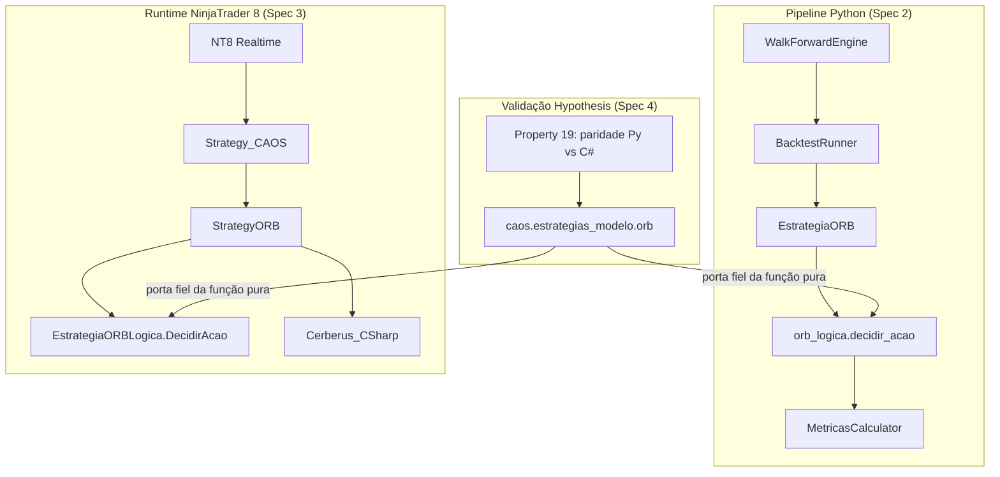

# Design Document

> Spec 4 — Estratégia ORB (Opening Range Breakout)

## Overview

A ORB é a primeira estratégia plugável real do CAOS. Implementa Opening Range Breakout em duas frentes coordenadas: Python (consumida pelo `WalkForwardEngine`) e C# (subclasse de `Strategy_CAOS` no NT8). As duas implementações compartilham uma função de decisão pura — `decidir_acao(barra, estado, parametros)` — que recebe uma barra OHLCV + estado interno + parâmetros e devolve uma das 4 ações canônicas: `LONG`, `SHORT`, `FECHAR`, `NADA`. A Property 19 (paridade Python ↔ C#) certifica que as duas portas tomam exatamente a mesma decisão para a mesma sequência de barras.

- Overview → seção 1
- Architecture → seção 2
- Components and Interfaces → seção 2
- Data Models → seção 3
- Error Handling → seção 7
- Testing Strategy → seção 8
- Correctness Properties → seção 8

## Architecture



**Decisão arquitetural-chave:** a regra de decisão é pura (sem I/O, sem timer real, sem random). Tanto o `EstrategiaORB` (Python plugado no Walk-Forward) quanto o `StrategyORB` (C# no NT8) são adaptadores finos que traduzem barras + estado de runtime para entrada da função de decisão e despacham a ação retornada via API local (`metricas.Trade` no Python, `EntrarLong/EntrarShort` no C#). Toda lógica não-trivial vive em `orb_logica.py` (Python) e `EstrategiaORBLogica.cs` (C#), portas diretas uma da outra.

## Components and Interfaces

### Função de decisão pura — assinatura compartilhada

```python
# caos/walk_forward/estrategias/orb_logica.py
@dataclass(frozen=True)
class ParametrosORB:
    minutos_or: int = 30
    risco_multiplicador: float = 1.0
    alvo_multiplicador: float = 2.0
    cooldown_minutos: int = 15
    hora_corte_entradas_utc: time = time(19, 0)
    sessao_inicio_utc: time = time(13, 30)
    sessao_fim_utc: time = time(20, 0)
    range_minimo_pontos: float = 0.5  # R3.3 — abaixo disso, sessão é pulada

@dataclass
class EstadoORB:
    sessao_corrente: Optional[date] = None
    high_or: float = float("-inf")
    low_or: float = float("inf")
    or_formado: bool = False
    posicao: Literal["LONG", "SHORT", "NADA"] = "NADA"
    cooldown_ate: Optional[datetime] = None
    entrou_nesta_sessao: bool = False  # R2.3

@dataclass(frozen=True)
class DecisaoORB:
    acao: Literal["LONG", "SHORT", "FECHAR", "NADA"]
    stop: Optional[float] = None
    alvo: Optional[float] = None
    motivo: str = ""

def decidir_acao(
    barra: Barra,           # timestamp + OHLCV (typed)
    estado: EstadoORB,      # mutado in-place
    parametros: ParametrosORB,
) -> DecisaoORB: ...
```

### `EstrategiaORB` (Python — plugin do Walk-Forward)

```python
class EstrategiaORB:
    """Plugin do WalkForwardEngine compatível com o Protocol Estrategia."""

    NOME = "EstrategiaORB"

    def __init__(self, parametros: Optional[ParametrosORB] = None): ...

    def treinar(self, historico: pd.DataFrame) -> None:
        # Reseta estado entre janelas (Engine reusa instância).
        self._estado = EstadoORB()
        self._trades = []
        self._trade_aberto = None

    def on_barra(self, barra, contexto) -> None:
        decisao = decidir_acao(_barra_de_series(barra), self._estado, self._parametros)
        if decisao.acao == "LONG":
            self._abrir(barra, decisao, lado="long")
        elif decisao.acao == "SHORT":
            self._abrir(barra, decisao, lado="short")
        elif decisao.acao == "FECHAR":
            self._fechar(barra)
        # NADA → no-op

    def finalizar(self) -> Sequence[metricas.Trade]:
        # Caso ainda haja trade aberto ao fim, fecha pelo último preço visto.
        return list(self._trades)
```

### `StrategyORB` (C# — subclasse de `Strategy_CAOS`)

```csharp
namespace NinjaTrader.NinjaScript.Strategies
{
    public class StrategyORB : Strategy_CAOS
    {
        [NinjaScriptProperty, Range(5, 60)]
        public int MinutosOR { get; set; } = 30;
        [NinjaScriptProperty, Range(0.5, 2.0)]
        public double RiscoMultiplicador { get; set; } = 1.0;
        [NinjaScriptProperty, Range(0.5, 5.0)]
        public double AlvoMultiplicador { get; set; } = 2.0;
        [NinjaScriptProperty, Range(0, 120)]
        public int CooldownMinutos { get; set; } = 15;
        // ... demais parâmetros (horários como string HH:mm UTC).

        private EstadoORB _estado;

        protected override void OnNovaBarra()
        {
            DecisaoORB d = EstrategiaORBLogica.DecidirAcao(
                BarraDe(Time[0], Open[0], High[0], Low[0], Close[0], Volume[0]),
                _estado,
                ParametrosCarregados());

            if (d.Acao == AcaoORB.LONG)
                EntrarLong(MaxContratos, d.Stop, d.Alvo, "ORB_LONG");
            else if (d.Acao == AcaoORB.SHORT)
                EntrarShort(MaxContratos, d.Stop, d.Alvo, "ORB_SHORT");
            else if (d.Acao == AcaoORB.FECHAR)
            {
                SairLong("ORB_LONG");
                SairShort("ORB_SHORT");
            }
        }
    }
}
```

### Espelho Python da função C# — `caos.estrategias_modelo.orb`

```python
# caos/estrategias_modelo/orb.py
class OrbModeloCSharpPort:
    """Reimplementação byte-a-byte de EstrategiaORBLogica.DecidirAcao em Python.

    Existe apenas para a Property 19: rodamos a mesma sequência de barras
    pelo decidir_acao "oficial" (orb_logica.py) e por este port C#-equivalente,
    e exigimos que retornem a mesma sequência de DecisaoORB.
    """
    @staticmethod
    def decidir_acao(barra, estado, parametros) -> DecisaoORB: ...
```

Em uma primeira iteração os dois "lados" são idênticos byte-a-byte (Python = referência canônica; C# = porta direta). A redundância só vira valor real na primeira vez que alguém precisa otimizar uma das pontas — aí a Property 19 trava qualquer divergência silenciosa.

## Data Models

### Barra (entrada da função de decisão)

```python
@dataclass(frozen=True)
class Barra:
    timestamp: datetime  # UTC, tz-aware
    open: float
    high: float
    low: float
    close: float
    volume: float
```

Representação minimalista: a função de decisão não precisa de mais nada além de OHLCV + timestamp.

### Schema do Trade emitido (para o Walk-Forward)

Reaproveita `caos.walk_forward.metricas.Trade` (entrada_timestamp, saida_timestamp, entrada_preco, saida_preco, lado, contratos, mfe_pontos, mae_pontos). Nenhum campo novo.

## Loop principal — Python (resumo)

1. `WalkForwardEngine` chama `EstrategiaORB.treinar(historico_treino)` no início de cada janela → reseta `EstadoORB`.
2. Para cada barra do `Periodo_Teste`, `BarrasTesteIterator` emite a barra → `on_barra(barra, contexto)`.
3. `on_barra` extrai OHLCV da `pd.Series`, chama `decidir_acao(barra_typed, estado, parametros)`.
4. Decisão `LONG`/`SHORT` abre trade local (registra entrada_timestamp/preco). Decisão `FECHAR` fecha o trade aberto, calcula PnL e empilha em `self._trades`.
5. Ao fim do teste, `finalizar()` devolve a lista de `Trade`s para o Engine.

## Loop principal — C# (resumo)

Idêntico em essência: `OnNovaBarra` (override) chama `EstrategiaORBLogica.DecidirAcao` e despacha via `EntrarLong/EntrarShort` (que roteiam por `Cerberus_CSharp`) ou `SairLong/SairShort`.

## Error Handling

| Cenário | Resposta |
|---|---|
| Range degenerado (R3.3) | `decidir_acao` retorna `NADA`; sessão pulada |
| Barra fora da Janela_Sessao_RTH | `decidir_acao` retorna `NADA` (não acumula no OR, não abre trade) |
| Posição aberta + chegou em `sessao_fim - 1min` | `decidir_acao` retorna `FECHAR` |
| `Close[0]` igual a `high_or` (toque exato, sem rompimento) | `NADA` (R2.1 exige `>` estrito, não `>=`) |
| Cooldown ativo | `decidir_acao` retorna `NADA` |
| Já entrou na sessão (`entrou_nesta_sessao=True`) | `decidir_acao` retorna `NADA` para entradas; `FECHAR` ainda funciona |

## Testing Strategy

### Testes unitários (`tests/unit/test_orb.py`)

- Range vazio (0 barras na janela OR) → `NADA` e sessão pulada.
- Range degenerado (`high_or - low_or < 0.5`) → `NADA`.
- Rompimento LONG limpo → `LONG` com stop = `low_or`, alvo = `Close[0] + R*alvo_mult`.
- Rompimento SHORT limpo → análogo.
- Cooldown ativo → recusa nova entrada.
- Hora de corte ultrapassada → `NADA` mesmo com rompimento.
- Fim de sessão com posição aberta → `FECHAR`.
- Já entrou na sessão (R2.3) → recusa segunda entrada no mesmo dia.

### Teste de integração com Walk-Forward (`tests/unit/test_orb_walk_forward_integrado.py`)

Fixture sintético: 3 sessões consecutivas, 1 com rompimento LONG, 1 com rompimento SHORT, 1 sem rompimento. Walk-Forward deve concluir com `status="concluido"`, 2 trades, PnL_total compatível com a regra (entrada+R*alvo_mult em LONG, entrada-R*alvo_mult em SHORT).

### Correctness Properties

(definidas em detalhe na seção `## Correctness Properties` abaixo).

## Correctness Properties

### Property 19: Paridade Python ↔ C# da Estratégia ORB

For every randomly generated sequence of OHLCV bars (gerada por Hypothesis com timestamps em UTC dentro de uma sessão RTH), `decidir_acao` (Python canônico) e `OrbModeloCSharpPort.decidir_acao` (Python que espelha exatamente a função C#) SHALL return the same `DecisaoORB` for every bar — incluindo `acao`, `stop`, `alvo` e `motivo`.

**Validates: Requirements 7.1, 7.2, 7.3**

Strategy: gera sequência de barras OHLCV razoáveis (preços ≈ 21000 ± 50, volumes ≈ 1000), gera parâmetros válidos da ORB, alimenta as duas portas com a mesma sequência mantendo estados separados, e exige tupla idêntica de `DecisaoORB` em cada barra. Falha em qualquer barra → bug em uma das portas.

### Property 20: Determinismo da ORB

For every pair of `WalkForwardEngine.executar` calls with same `(seed, ConfiguracaoWalkForward, manifesto_hash, ParametrosORB)`, the resulting `ResultadoWalkForward` SHALL be byte-identical (mesmas janelas, mesmos trades, mesmos PnLs).

**Validates: Requirements 6.1, 6.2**

Strategy: idêntica à Property 14 (Spec 2) mas usando `EstrategiaORB` no lugar de `EstrategiaSempreVencedora`. Exercita a determinismo end-to-end com uma estratégia real.

## Estrutura de Diretórios

```
04_CODIGO/
  ninjascript/
    StrategyORB.cs             # subclasse de Strategy_CAOS
    EstrategiaORBLogica.cs     # função pura DecidirAcao

CAOS_Orchestrator/
  caos/
    walk_forward/
      estrategias/
        orb.py                 # EstrategiaORB plugin
        orb_logica.py          # decidir_acao (canônico Python)
    estrategias_modelo/        # NOVO pacote
      __init__.py
      orb.py                   # OrbModeloCSharpPort (espelho do C#)
  tests/
    unit/
      test_orb.py
      test_orb_walk_forward_integrado.py
    property/
      test_orb_python_csharp_paridade.py   # Property 19
      test_orb_determinismo.py             # Property 20
```
