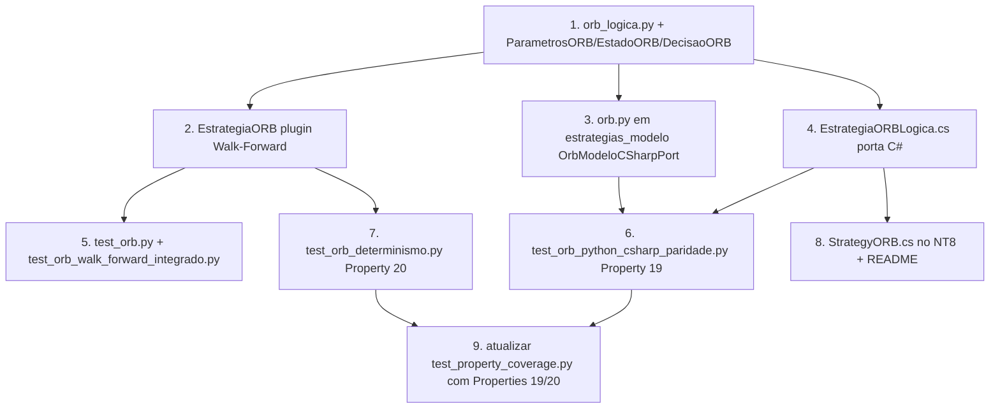

# Implementation Plan

> Spec 4 — Estratégia ORB (Opening Range Breakout)

## Overview

8 tarefas que entregam a primeira estratégia plugável real do CAOS. Idioma pt-BR; plataforma Windows + cmd para Python; NinjaScript Editor (F5) para a versão C#. Integra com Walk-Forward (Spec 2) e Strategy_CAOS (Spec 3).

## Task Dependency Graph



```json
{
  "waves": [
    {"wave": 1, "tasks": ["1"]},
    {"wave": 2, "tasks": ["2", "3", "4"]},
    {"wave": 3, "tasks": ["5", "6", "7", "8"]},
    {"wave": 4, "tasks": ["9"]}
  ],
  "dependencies": {
    "1": [],
    "2": ["1"],
    "3": ["1"],
    "4": ["1"],
    "5": ["2"],
    "6": ["3", "4"],
    "7": ["2"],
    "8": ["4"],
    "9": ["6", "7"]
  }
}
```

## Tasks

- [ ] 1. `caos/walk_forward/estrategias/orb_logica.py`
  - Define `Barra`, `ParametrosORB`, `EstadoORB`, `DecisaoORB` (dataclasses).
  - Implementa `decidir_acao(barra, estado, parametros) -> DecisaoORB` cobrindo R1, R2, R3, R4 — função pura canônica.
  - Validação de parâmetros via `__post_init__` em `ParametrosORB` (ranges de R5).
  - **Cobre**: R1, R2, R3, R4, R5.

- [ ] 2. `caos/walk_forward/estrategias/orb.py` — plugin do Walk-Forward
  - Classe `EstrategiaORB` compatível com o Protocol `Estrategia` (Spec 2).
  - `treinar` reseta estado; `on_barra` chama `decidir_acao` e despacha; `finalizar` devolve `list[metricas.Trade]`.
  - Reaproveita `metricas.Trade` (Spec 2) — não cria modelo novo.
  - **Cobre**: R2 (despacho), R3 (stop/alvo), R4 (cooldown/fim de sessão), R6.2 (sem random).

- [ ] 3. `caos/estrategias_modelo/__init__.py` + `caos/estrategias_modelo/orb.py`
  - Novo pacote-espelho semelhante a `caos/ninjascript_modelo/`.
  - `OrbModeloCSharpPort.decidir_acao` reproduz byte-a-byte a função C# que será escrita na Task 4.
  - Em primeira iteração, simplesmente delega para `decidir_acao` canônico (são equivalentes nesta versão); a duplicação só importa quando o C# for otimizado.
  - **Cobre**: R7.1, R7.2.

- [ ] 4. `04_CODIGO/ninjascript/EstrategiaORBLogica.cs` — porta C# da função pura
  - Estruturas C# `BarraORB`, `ParametrosORB`, `EstadoORB`, `DecisaoORB`, enum `AcaoORB`.
  - Método estático `EstrategiaORBLogica.DecidirAcao` reproduzindo `decidir_acao` Python.
  - Sem dependência do runtime do NinjaScript — é classe pura, igual a `Cerberus_CSharp`.
  - **Cobre**: R7.2.

- [ ] 5. `tests/unit/test_orb.py` + `tests/unit/test_orb_walk_forward_integrado.py`
  - Unitários: range vazio, range degenerado, rompimento LONG/SHORT, cooldown, hora de corte, fim de sessão, segunda entrada bloqueada.
  - Integrado: 3 sessões sintéticas + `WalkForwardEngine.executar` → `status="concluido"`, `numero_trades >= 1`.
  - **Cobre**: R8.1, R8.2.

- [ ] 6. `tests/property/test_orb_python_csharp_paridade.py` — Property 19
  - Hypothesis: gera sequência OHLCV razoável (preços ~21000±50, volumes ~1000) + `ParametrosORB` válidos.
  - Roda `decidir_acao` (canônico) e `OrbModeloCSharpPort.decidir_acao` (espelho C#) com estados separados.
  - Asserção: `DecisaoORB` idêntica em cada barra.
  - Marca `**Validates: Requirements 7.1, 7.2, 7.3**`.
  - **Cobre**: R7.3.

- [ ] 7. `tests/property/test_orb_determinismo.py` — Property 20
  - Hypothesis: gera config Walk-Forward + parâmetros ORB.
  - Roda `WalkForwardEngine.executar` 2x com mesma seed/config/dados, valida byte-igualdade dos trades por janela.
  - Marca `**Validates: Requirements 6.1, 6.2**`.
  - **Cobre**: R6.

- [ ] 8. `04_CODIGO/ninjascript/StrategyORB.cs` + `04_CODIGO/ninjascript/README.md`
  - `StrategyORB` herdando de `Strategy_CAOS`; `OnNovaBarra` chama `EstrategiaORBLogica.DecidirAcao` e despacha via `EntrarLong`/`EntrarShort`/`SairLong`/`SairShort`.
  - `[NinjaScriptProperty]` com `[Range(...)]` para todos os parâmetros (R5.2).
  - Atualiza `README.md` da pasta `04_CODIGO/ninjascript/` com seção "Estratégias incluídas → ORB".
  - **Cobre**: R5.2, R9.2, R9.3.

- [ ] 9. Atualizar `tests/property/test_property_coverage.py`
  - Estender `PROPERTIES_ESPERADAS` com Properties 19, 20.
  - Adicionar `caos-orb: (19, 20)` em `DESIGN_MD_PROPERTIES_POR_SPEC`.
  - Atualizar `NUMEROS_PROPERTY_ESPERADOS` para `range(1, 21)`.
  - **Cobre**: R8.3 (gate de propriedades).

## Notes

- **Não otimizar parâmetros** neste spec — Spec 4 entrega a estratégia rodável; tuning vem em spec posterior via Walk-Forward.
- **MNQ é assumido**: cálculo de PnL em pontos × contratos (mesmo do `MetricasCalculator` do Spec 2).
- **Não precisa de dados MNQ reais** para a suíte automatizada — todos os testes usam fixtures sintéticos. Quando os dados voltarem, basta apontar `caos walk-forward run --estrategia caos.walk_forward.estrategias.orb:EstrategiaORB`.
- A Task 8 (C# em `StrategyORB.cs`) só vai realmente compilar quando o usuário copiar para o NT8 e dar F5 — Hermes/Skill_MSBuild não é mais usada no escopo do Spec 3 (decisão arquitetural).
