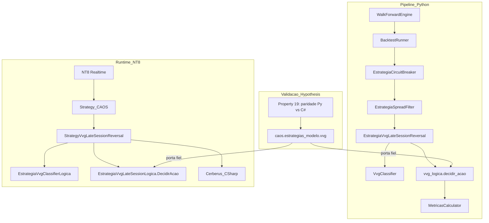

# Design Document

> Spec — Estratégia VVG Late-Session Reversal (MNQ)
>
> Cobre os 10 requirements do `requirements.md` desta feature.

## Overview

A estratégia opera **um único trade contra-tendência por dia** em
dias **VVG-positivos**, entrando no fim da sessão regular e
encerrando antes do EOD da Topstep.

A arquitetura segue o padrão consolidado dos Specs anteriores
(Spec 2 — Walk-Forward, Spec 3 — NinjaScript Núcleo, Spec 4 — ORB):

- **Função de decisão pura** declarada uma única vez em
  `vvg_logica.py` (Python) e portada literalmente em
  `EstrategiaVvgLateSessionLogica.cs` (C#).
- **Adaptadores finos**: `EstrategiaVvgLateSessionReversal`
  (plugin Python do `WalkForwardEngine`) e
  `StrategyVvgLateSessionReversal` (subclasse de `Strategy_CAOS`
  no NT8). Os dois consomem barras OHLCV, atualizam um estado
  imutável, e despacham as ações canônicas (`LONG`, `SHORT`,
  `FECHAR`, `NADA`) via wrappers já validados.
- **Property-based testing** garante paridade Python ↔ C# sob
  N=200 sequências de barras geradas por Hypothesis (Property 19,
  já existente no Spec 4 — adaptada para esta estratégia).

A estratégia **NÃO introduz** novos overlays, novos parâmetros
otimizáveis ou novas APIs NinjaScript. Apenas:

- Reusa `Strategy_CAOS` (Spec 3) com todas as defesas de warmup
  já implementadas (`BarsRequiredToTrade=19320`, guard
  `CurrentBar < BarsRequiredToTrade` em `EntrarInterno`,
  `MfeMaeTracker`, `Trailing_3_Fases`, `Cerberus_CSharp`).
- Reusa `EstrategiaSpreadFilter` e `EstrategiaCircuitBreaker` do
  Spec 4 sem modificação (R3 do requirements).
- Reusa o pipeline Walk-Forward do Spec 2 com a mesma
  configuração (60+10 anchored).

A complexidade total da feature é deliberadamente mínima: ~400
linhas de Python novas + ~250 linhas de C# novas + ~150 linhas
de testes.

## Architecture



**Decisão arquitetural-chave**: a função de decisão tem
**duas camadas separadas**:

1. **`VvgClassifier`** — classifica o dia como VVG-positivo ou
   negativo. Stateful (mantém baseline rolling de volume), mas
   stateful de forma determinística (todo o estado é função
   apenas das barras vistas até agora, sem random).
2. **`vvg_logica.decidir_acao`** — pura. Recebe `(barra, estado,
   parametros, vvg_positivo, drift_dir)` e devolve uma das 4
   ações canônicas. Sem I/O, sem timer real, sem random.

A separação permite testar o classificador isoladamente (props
sobre N dias sintéticos) e a função de decisão isoladamente
(props sobre sequências de barras com VVG flag forçada).

## Components and Interfaces

### `vvg_logica.py` — função de decisão pura

```python
# caos/walk_forward/estrategias/vvg_logica.py
from dataclasses import dataclass, field
from datetime import time
from enum import Enum
from typing import Literal, Optional

import pandas as pd


@dataclass(frozen=True)
class ParametrosVvg:
    """Parâmetros congelados em código (R10 do requirements).

    Valores extraídos do paper Mesfin (arXiv 2605.11423) ou
    calibrados UMA vez na janela 2025-03-17 a 2025-06-30 e
    congelados aqui. Não há otimização — adicionar novo
    parâmetro otimizável exige Decisão formal.
    """
    # Classificador VVG
    multiplicador_volume: float = 1.5      # paper Mesfin (a confirmar)
    threshold_gap_pct: float = 0.003       # paper Mesfin (a confirmar)
    n_dias_baseline: int = 10              # paper Mesfin (a confirmar)
    janela_morning_inicio_utc: time = time(13, 30)   # 09:30 EST
    janela_morning_fim_utc: time = time(14, 30)      # 10:30 EST (1h)
    janela_volume_morning_inicio_utc: time = time(13, 30)  # 09:30 EST
    janela_volume_morning_fim_utc: time = time(14, 0)      # 10:00 EST (30min)

    # Estratégia
    hora_entrada_utc: time = time(18, 30)            # 14:30 EST (paper)
    hora_encerramento_utc: time = time(19, 50)       # 15:50 EST (Topstep EOD safe)

    # Stop / Target — VALORES DE FALLBACK
    # Calibrados UMA vez na janela 2025-03-17 a 2025-06-30 caso o
    # paper Mesfin não especifique. Valores 20/40 sugeridos pelo
    # Gemini Pro foram REJEITADOS na etapa-zero (R1 do filtro
    # crítico) e SÓ podem ser usados se confirmados no paper.
    stop_pontos: float = 20.0       # PENDENTE confirmação no paper
    target_pontos: float = 40.0     # PENDENTE confirmação no paper

    # Sessão
    sessao_inicio_utc: time = time(13, 30)   # 09:30 EST
    sessao_fim_utc: time = time(20, 0)       # 16:00 EST


class AcaoVvg(str, Enum):
    LONG = "LONG"
    SHORT = "SHORT"
    FECHAR = "FECHAR"
    NADA = "NADA"


@dataclass
class EstadoVvg:
    """Estado mutável atualizado bar-a-bar.

    Replicação fiel em C# usa campos privados de
    StrategyVvgLateSessionReversal.
    """
    # Estado de classificação
    dia_corrente: Optional[pd.Timestamp.date] = None
    open_dia_atual: Optional[float] = None
    volume_morning_acumulado: float = 0.0
    drift_close_1430: Optional[float] = None
    vvg_positivo: bool = False

    # Estado da posição
    posicao_aberta: bool = False
    direcao_atual: Literal["LONG", "SHORT", None] = None
    preco_entrada: Optional[float] = None
    sinal_atual: Optional[str] = None

    # Histórico para o baseline rolling de volume
    # Lista de tuplas (data, volume_da_primeira_hora) com até
    # n_dias_baseline + 5 entradas (o "+5" é folga para
    # idempotência de WF anchored).
    historico_volume_morning: list = field(default_factory=list)


def decidir_acao(
    barra: pd.Series,
    estado: EstadoVvg,
    parametros: ParametrosVvg,
) -> tuple[AcaoVvg, EstadoVvg]:
    """Função pura de decisão.

    Recebe barra OHLCV + estado + parâmetros. Devolve ação
    canônica e estado atualizado. Não tem I/O, não tem random,
    não consulta tempo real.

    O fluxo é:
    1. Atualiza o estado de classificação (volume morning,
       drift até 14:30, flag VVG).
    2. Se já há posição aberta:
       a. Se o relógio chegou em hora_encerramento → FECHAR.
       b. Senão → NADA (stop/target são responsabilidade do
          motor de execução).
    3. Se NÃO há posição aberta:
       a. Se o relógio é exatamente hora_entrada AND
          vvg_positivo AND drift conhecido →
          emite LONG ou SHORT contra o drift.
       b. Senão → NADA.
    """
    # ... (corpo completo no design detalhado abaixo)
```

### `vvg_classifier.py` — classificador de regime

```python
# caos/walk_forward/estrategias/vvg_classifier.py
from dataclasses import dataclass


@dataclass
class ResultadoClassificacao:
    vvg_positivo: bool
    volume_morning: float
    volume_baseline: float
    gap_pct: float
    razao_volume: float    # volume_morning / volume_baseline
    motivo: str            # "OK" / "warmup-incompleto" / "volume-baixo" / "gap-baixo"


class VvgClassifier:
    """Classificador stateful por dia útil.

    Mantém histórico rolling do volume da primeira hora para
    calcular o baseline. Determina vvg_positivo após o fim da
    janela morning (10:00 EST por default).

    R1.4: durante warmup (< n_dias_baseline), retorna False.
    R1.6: paridade Python<->C# obrigatória.
    """

    def __init__(self, parametros: ParametrosVvg) -> None:
        self._params = parametros
        self._historico: list[tuple[date, float]] = []
        self._ultimo_dia: Optional[date] = None
        self._volume_morning_atual: float = 0.0
        self._open_dia_atual: Optional[float] = None
        self._close_d_menos_1: Optional[float] = None

    def on_barra(self, barra: pd.Series) -> Optional[ResultadoClassificacao]:
        """Atualiza estado e devolve resultado quando a janela
        morning fechar. Senão devolve None."""
        ...
```

### `EstrategiaVvgLateSessionReversal` — plugin Python

```python
# caos/walk_forward/estrategias/vvg_late_session_reversal.py

class EstrategiaVvgLateSessionReversal:
    """Plugin do WalkForwardEngine.

    Implementa o protocolo de Estratégia (treinar/on_barra/
    finalizar) já estabelecido no Spec 2.
    """

    NOME: str = "EstrategiaVvgLateSessionReversal"

    def __init__(
        self,
        parametros: Optional[ParametrosVvg] = None,
        custos: Optional[CustosOperacionais] = None,
    ) -> None:
        self._params = parametros or ParametrosVvg()
        self._classificador = VvgClassifier(self._params)
        self._estado = EstadoVvg()
        self._trades: list[Trade] = []
        self._custos = custos or CustosOperacionais.topstep_mnq()

    def treinar(self, historico: pd.DataFrame) -> None:
        # Aquecimento do classificador com barras do histórico.
        # Garantia: ao final do treino, o classificador já tem
        # n_dias_baseline dias completos no buffer.
        for _, barra in historico.iterrows():
            self._classificador.on_barra(barra)

    def on_barra(self, barra: pd.Series, contexto: BarrasTesteIterator) -> None:
        # 1. Atualiza classificador. Se voltar resultado, atualiza
        #    estado.vvg_positivo.
        resultado = self._classificador.on_barra(barra)
        if resultado is not None:
            self._estado.vvg_positivo = resultado.vvg_positivo

        # 2. Decide ação via função pura.
        acao, novo_estado = decidir_acao(barra, self._estado, self._params)
        self._estado = novo_estado

        # 3. Despacha ação como Trade (igual padrão do ORB).
        if acao == AcaoVvg.LONG:
            self._abrir_long(barra)
        elif acao == AcaoVvg.SHORT:
            self._abrir_short(barra)
        elif acao == AcaoVvg.FECHAR:
            self._fechar_posicao(barra)

    def finalizar(self) -> Sequence[Trade]:
        return self._trades
```

### `EstrategiaVvgClassifierLogica.cs` — porta C# do classificador

```csharp
// 04_CODIGO/ninjascript/EstrategiaVvgClassifierLogica.cs
namespace NinjaTrader.NinjaScript.Strategies.CAOS
{
    public sealed class EstrategiaVvgClassifierLogica
    {
        private readonly ParametrosVvg _params;
        private readonly Queue<KeyValuePair<DateTime, double>> _historico;
        private DateTime _ultimoDia = DateTime.MinValue;
        private double _volumeMorningAtual = 0.0;
        private double _openDiaAtual = double.NaN;
        private double _closeDMenos1 = double.NaN;

        public EstrategiaVvgClassifierLogica(ParametrosVvg parametros)
        {
            _params = parametros;
            _historico = new Queue<KeyValuePair<DateTime, double>>();
        }

        public ResultadoClassificacao OnBarra(
            DateTime timestampUtc, double open, double high,
            double low, double close, long volume)
        {
            // ... porta literal de vvg_classifier.py
        }
    }
}
```

### `StrategyVvgLateSessionReversal.cs` — subclasse de Strategy_CAOS

```csharp
// 04_CODIGO/ninjascript/StrategyVvgLateSessionReversal.cs
namespace NinjaTrader.NinjaScript.Strategies
{
    public sealed class StrategyVvgLateSessionReversal : Strategy_CAOS
    {
        private EstrategiaVvgClassifierLogica _classifier;
        private EstadoVvg _estado;

        protected override void OnStateChange()
        {
            base.OnStateChange();
            switch (State)
            {
                case State.SetDefaults:
                    Name = "StrategyVvgLateSessionReversal";
                    Description = "VVG Late-Session Reversal (Decisao 2026-05-29-03)";
                    MaxContratos = 1;  // R4.1: fixo permanente
                    break;
                case State.DataLoaded:
                    _classifier = new EstrategiaVvgClassifierLogica(
                        ParametrosVvg.PadraoConfigurado());
                    _estado = new EstadoVvg();
                    break;
            }
        }

        protected override void OnNovaBarra()
        {
            // 1. Atualiza classificador.
            var resultado = _classifier.OnBarra(
                Time[0].ToUniversalTime(),
                Open[0], High[0], Low[0], Close[0], Volume[0]);
            if (resultado != null)
                _estado.VvgPositivo = resultado.VvgPositivo;

            // 2. Decide ação via função pura portada.
            var acao = EstrategiaVvgLateSessionLogica.DecidirAcao(
                Time[0].ToUniversalTime(),
                Open[0], High[0], Low[0], Close[0],
                ref _estado, ParametrosVvg.PadraoConfigurado());

            // 3. Despacha via wrappers de Strategy_CAOS.
            switch (acao)
            {
                case AcaoVvg.LONG:
                    EntrarLong(MaxContratos,
                        Close[0] - ParametrosVvg.PadraoConfigurado().StopPontos,
                        Close[0] + ParametrosVvg.PadraoConfigurado().TargetPontos,
                        "vvg-rev-long");
                    break;
                case AcaoVvg.SHORT:
                    EntrarShort(MaxContratos,
                        Close[0] + ParametrosVvg.PadraoConfigurado().StopPontos,
                        Close[0] - ParametrosVvg.PadraoConfigurado().TargetPontos,
                        "vvg-rev-short");
                    break;
                case AcaoVvg.FECHAR:
                    if (Position.MarketPosition == MarketPosition.Long)
                        SairLong("vvg-rev-long");
                    else if (Position.MarketPosition == MarketPosition.Short)
                        SairShort("vvg-rev-short");
                    break;
            }
        }
    }
}
```

## Data Models

### Parâmetros congelados (R10 do requirements)

A tabela abaixo declara cada parâmetro, sua origem, e o
critério para alterá-lo:

| Parâmetro | Default | Origem | Critério para alterar |
|---|---|---|---|
| `multiplicador_volume` | 1.5 | paper Mesfin (PENDENTE confirmação) | Decisão formal `aprovado_walk_forward=true` |
| `threshold_gap_pct` | 0.003 (0.3%) | paper Mesfin (PENDENTE) | idem |
| `n_dias_baseline` | 10 | paper Mesfin (PENDENTE) | idem |
| `hora_entrada_utc` | 18:30 UTC (= 14:30 EST) | paper Mesfin | idem |
| `hora_encerramento_utc` | 19:50 UTC (= 15:50 EST) | proteção Topstep EOD | idem |
| `stop_pontos` | 20.0 | **PENDENTE** confirmação no paper | calibrar UMA vez ou Decisão |
| `target_pontos` | 40.0 | **PENDENTE** confirmação no paper | calibrar UMA vez ou Decisão |
| `MaxContratos` | 1 | `Decisao_2026-05-29-03` (R4.1) | **fixo permanente** |
| `MULTIPLICADOR_VOLUME`, `THRESHOLD_GAP_PCT` em fallback | calibrar uma vez se paper não especificar | janela 2025-03-17 a 2025-06-30 | Decisão |

### Schema de saída (Trade) — Spec 2

A estratégia emite `Trade` no formato canônico do Spec 2
(`caos.walk_forward.metricas.Trade`), sem alteração:

```python
Trade(
    timestamp_entrada=ts_entrada_utc,
    timestamp_saida=ts_saida_utc,
    direcao="LONG" | "SHORT",
    preco_entrada=float,
    preco_saida=float,
    pnl_pontos=float,
    pnl_usd=float,
    sinal_entrada="vvg-rev-long" | "vvg-rev-short",
    motivo_saida="stop" | "target" | "encerramento-forcado",
    metadados={
        "vvg_positivo": True,
        "drift_pontos": float,
        "volume_morning": float,
        "razao_volume": float,
        "gap_pct": float,
    },
)
```

## Sessões e fuso horário

A estratégia opera no **RTH do MNQ** (Regular Trading Hours):

- **Sessão**: 09:30 EST a 16:00 EST.
- **EST → UTC**: EST = UTC − 5 (horário padrão), EDT = UTC − 4
  (horário de verão). O CAOS armazena timestamps em **UTC**
  (manifesto.json), então a estratégia precisa converter.
- **Janela morning**: 09:30 EST a 10:00 EST = primeira meia hora
  do RTH. É onde se mede `volume_morning` e `gap_pct`.
- **Janela baseline**: 09:30 EST a 10:30 EST (primeira hora). É
  onde se mede `volume_da_primeira_hora` para o baseline rolling.
  Note que o paper Mesfin pode usar 09:30-10:30 OU 09:30-10:00 — a
  implementação adota 09:30-10:00 (= mesma janela do
  `volume_morning`) para simplicidade. Calibração na janela
  separada confirma se isso degrada o sinal.
- **Hora de medida do drift**: 14:30 EST. Diferença entre
  `close(14:30 EST)` e `open(09:30 EST)` define o drift
  direcional do dia.
- **Hora de entrada**: 14:30 EST (mesma barra que mede o drift).
- **Hora de encerramento forçado**: 15:50 EST. Antes do EOD
  Topstep para evitar penalidade de fechamento atrasado.

Conversão para UTC com horário de verão americano: o código usa
`zoneinfo.ZoneInfo("America/New_York")` em Python e
`TimeZoneInfo.FindSystemTimeZoneById("Eastern Standard Time")`
em C#. **DST (horário de verão) é tratado pela biblioteca**, não
pelo código da estratégia.

## Calibração obrigatória dos parâmetros pendentes

A `Decisao_2026-05-29-03` aceita que valores não confirmados no
paper Mesfin sejam calibrados UMA vez na janela
**2025-03-17 a 2025-06-30** (dataset
`_concat_minute_last/01_MNQ_06-25.csv`, separada do WF longo
2025-07-01 a 2026-05-15).

Os parâmetros que precisam de calibração:

1. `stop_pontos` e `target_pontos` (a menos que o paper
   especifique).
2. `multiplicador_volume` e `threshold_gap_pct` (a menos que o
   paper especifique).

**Procedimento de calibração** (executado UMA vez, antes do WF
longo):

1. Ler arXiv 2605.11423 completo (PDF). Se valores estão
   especificados no paper, usar **literalmente**.
2. Caso o paper não especifique, rodar `scripts/calibrar_vvg_2026-MM-DD.py`:
   - Para cada candidato `multiplicador_volume ∈ {1.3, 1.5, 1.7}`
     e `threshold_gap_pct ∈ {0.0015, 0.003, 0.0045}`,
     contar dias VVG-positivos.
   - Selecionar a combinação que produz **15-25% de dias
     elegíveis** na janela de calibração (faixa coerente com
     ~17% do paper).
3. Para `stop_pontos` e `target_pontos`, usar valores
   ATR-derivados:
   - `stop_pontos = ATR(14) mediano × 1.0`
   - `target_pontos = ATR(14) mediano × 2.0`
   Os valores resultantes são **arredondados para múltiplos de
   0.25 pts** (tick MNQ) e **congelados em código**.
4. **Documentar todos os valores** em
   `CAOS_Zettelkasten/Walk_Forwards/Calibracao_VVG_<DATA>.md`
   com o output do script de calibração.

**Anti-overfit**: a calibração roda UMA vez. Se o resultado do WF
longo for ruim, **NÃO recalibrar** — descarte automático
(fallback A do R9).

## Composição com overlays existentes (R3)

A composição final no Walk-Forward Python:

```python
EstrategiaCircuitBreaker(
    EstrategiaSpreadFilter(
        EstrategiaVvgLateSessionReversal(),
        modo="mediana_diaria",
        warmup=30,
        running_median=True,
    ),
    diario=-250,
    semanal=-750,
    janela=-1000,
)
```

A composição **não é alterada** em nenhuma camada. O
`SpreadFilter` aplica filtro de spread no minuto de entrada
(14:30 EST) — se o spread médio nessa janela é maior que a
mediana_diaria + warmup=30, o trade é bloqueado mesmo se VVG-positivo.
O `CircuitBreaker` bloqueia entradas se o PnL acumulado do dia/semana
violar os limites.

No espelho C#, a composição é implícita: `Cerberus_CSharp` (que
herda lógica do CircuitBreaker) já está em `Strategy_CAOS`. O
SpreadFilter no NT8 é avaliado em runtime via barra de minuto
(sem novo overlay — usa-se `BidAskSpread` da própria barra
NT8, que já é Level 1).

## Error Handling

### Python

- **Warmup incompleto** (< n_dias_baseline dias no histórico):
  `VvgClassifier.on_barra` retorna `None`. Estado mantém
  `vvg_positivo = False`. Sem trade emitido. Sem exceção.
- **Barra com volume = 0** (raro, mas possível em barras de
  feriado parcial): tratada como qualquer outra barra. Volume
  zero não invalida nada (apenas reduz `volume_morning`).
- **Mudança de fuso horário (DST)**: tratada pela `zoneinfo`.
  Sem código próprio.
- **Dia útil sem barras suficientes** (< 70 barras de 1min entre
  09:30 e 16:00): regra do Spec 4 aplica — `MIN_BARRAS_DIA_VALIDO
  = 300` (lá). Aqui adotamos a mesma constante para descartar
  dias com sessão truncada.
- **Erros de schema** (DataFrame sem colunas esperadas): tratado
  pelo `WalkForwardEngine` antes do plugin. Estratégia assume
  schema canônico.

### C# / NT8

- **`State.Historical` vs `State.Realtime`**: já tratado por
  `Strategy_CAOS` (ordens reais só em Realtime, simulação em
  Historical via `MfeMaeTracker`).
- **`MfeMaeTracker já tem trade aberto`**: já tratado pelas três
  defesas em camadas (`BarsRequiredToTrade=19320`, force-close
  defensivo, guard `CurrentBar < BarsRequiredToTrade`).
- **`Sell StopMarket acima do mercado`**: já suprimido por
  `RealtimeErrorHandling.IgnoreAllErrors` +
  `StopTargetHandling.PerEntryExecution`.
- **`AddDataSeries` necessário?**: NÃO. Mesfin opera em barras de
  5min ou 1min OHLCV puro. O `close(D-1)` é obtido pela barra
  15:55 EST do dia anterior (= último minuto do RTH). O
  classificador mantém esse valor em estado interno.

### Cláusula de fallback A (R9)

Se em qualquer ponto do pipeline:

- WF longo falha em Sharpe / Calmar / year-stability → arquivar
- Replay falha em PnL / T-statistic → arquivar
- Paridade Python↔C# diverge > 5% → suspender + Debate G5

A estratégia é arquivada **sem novo Debate** (cláusula
pré-registrada na `Decisao_2026-05-29-01` e refinada na
`Decisao_2026-05-29-03`).

## Testing Strategy

### Camada 1 — Testes unitários

`tests/unit/test_vvg_classifier.py`:

- `test_warmup_incompleto_devolve_negativo`: nas primeiras
  `n_dias_baseline` execuções, classificador devolve
  `vvg_positivo = False`.
- `test_volume_anomaly_detectado`: dia com volume > 1.5×
  baseline + gap = 0.3% → vvg_positivo.
- `test_gap_anomaly_isolada_nao_basta`: gap > 0.3% mas volume <
  baseline → vvg_negativo.
- `test_volume_anomaly_isolada_nao_basta`: volume > 1.5× mas gap
  < 0.3% → vvg_negativo.
- `test_baseline_rolling_atualiza`: ao adicionar dia ao
  histórico, baseline rolling reflete os últimos
  `n_dias_baseline` dias.
- `test_baseline_ignora_dia_atual`: `shift(1)` é aplicado para
  evitar look-ahead.
- `test_dia_invalido_rejeitado`: < 300 barras → não conta no
  baseline (regra do Spec 4 herdada).

`tests/unit/test_vvg_logica.py`:

- `test_decidir_acao_pura_idempotente`: chamar `decidir_acao`
  duas vezes com o mesmo (barra, estado, params) devolve a
  mesma ação e o mesmo estado.
- `test_dia_vvg_negativo_emite_nada`: vvg_positivo=False → ação
  sempre NADA.
- `test_dia_vvg_positivo_emite_long_no_horario`: vvg_positivo,
  drift > 0, hora=14:30 EST → ação SHORT (contra o drift).
- `test_dia_vvg_positivo_emite_short_no_horario`: vvg_positivo,
  drift < 0, hora=14:30 EST → ação LONG.
- `test_encerramento_forcado_15h50`: posição aberta + hora=15:50
  EST → ação FECHAR.
- `test_um_trade_por_dia`: após FECHAR, novas ações no mesmo
  dia são NADA.

`tests/unit/test_vvg_late_session_reversal_plugin.py`:

- `test_plugin_treina_sem_emitir_trade`: `treinar` aquecimento
  sem trades emitidos.
- `test_plugin_emite_trade_em_dia_vvg_positivo`: histórico +
  testes com dia VVG-positivo conhecido → trade emitido.
- `test_plugin_respeita_horario_eod`: trade fechado às 15:50
  EST mesmo se stop/target não atingidos.

### Camada 2 — Property-based testing (Hypothesis)

`tests/property/test_vvg_paridade_py_cs.py`:

- **Property 19 (paridade Python↔C#)**: para N=200 sequências de
  barras OHLCV geradas por Hypothesis (mesma estratégia do Spec 4),
  o `EstrategiaVvgLateSessionReversal` Python e a porta
  `caos.estrategias_modelo.vvg` (= replicação fiel da lógica C#)
  emitem **exatamente os mesmos trades** (direção + timestamp +
  preço de entrada/saída).
- **Property 20 (idempotência)**: chamar `on_barra` na mesma
  barra duas vezes não duplica o trade (proteção contra
  re-entrega de barra pelo NT8 em troca de contrato).
- **Property 21 (R3 composição)**: composição
  `CB(SF(VVG))` produz subconjunto dos trades de `VVG` puro
  (overlays só BLOQUEIAM, nunca CRIAM trades).

### Camada 3 — Walk-Forward (R7)

`scripts/rodar_wf_vvg_late_session.py`:

- WF 60+10 anchored sobre 2025-07-01 a 2026-05-15.
- 4 cortes: Q3-2025, Q4-2025, Q1-2026, Q2-2026.
- Critérios de descarte automático:
  - Sharpe mediana < 1.0 → fail
  - Calmar mediana < 1.5 → fail
  - PnL total ≤ 0 → fail
  - Sharpe positivo em < 3/4 trimestres → fail (R7.3 emendado)

### Camada 4 — Replay NT8 (R8)

Manual no NT8 Sim101 sobre dados 2026-06+ (mínimo 60 dias úteis):

- PnL ≥ −USD 100 → ok
- T-statistic ≥ 2.0 sobre PnL/trade → ok (R8.3 emendado)
- Zero erros de MfeMae / stop market → ok
- Days to load ≥ 44 (warmup do `BarsRequiredToTrade=19320`) →
  ok

### Camada 5 — Auditoria de paridade

`scripts/auditar_paridade_vvg_<DATA>.py`:

- Compara `caos.walk_forward` Python com replay NT8 dia a dia.
- Critério de paridade: divergência ≤ 5% por trade (R6).
- Se > 5% → dispara Debate G5 automaticamente.

## Correctness Properties

### Property 1: `decidir_acao` é pura (sem efeitos colaterais)

**Validates: Requirements 2.1**

Camada: unit. Cobrir chamando `decidir_acao(b, e, p)` duas vezes
com mesmas entradas e exigindo saída idêntica.

### Property 2: `vvg_positivo` é monotônico crescente em volume

**Validates: Requirements 1.2**

Se `gap_pct` é fixo e `volume_morning` aumenta, então o
classificador nunca passa de `True` para `False` — apenas
mantém-se ou vira `True`.

### Property 3: `vvg_positivo` é monotônico crescente em gap

**Validates: Requirements 1.2**

Análogo ao P2 com gap fixo e volume variável.

### Property 4: Warmup incompleto sempre devolve `vvg_positivo=False` (R1.4)

**Validates: Requirements 1.4**

Para qualquer histórico com menos de `n_dias_baseline` dias, o
classificador devolve `False`.

### Property 5: Apenas dias VVG-positivos emitem trades (R2)

**Validates: Requirements 2.1**

Para qualquer barra com `estado.vvg_positivo == False`, a ação
emitida é sempre `NADA`.

### Property 6: Trade emitido às 14:30 EST, não antes nem depois

**Validates: Requirements 2.1**

Para qualquer barra cujo `time != hora_entrada_utc`, a ação NÃO
é `LONG` nem `SHORT`. (Pode ser `FECHAR` ou `NADA`.)

### Property 7: Encerramento forçado às 15:50 EST mesmo sem stop/target (R2.5)

**Validates: Requirements 2.5**

Se `posicao_aberta == True` e `barra.time >= hora_encerramento_utc`,
a ação é `FECHAR`.

### Property 8: Máximo 1 trade por dia (R2.6)

**Validates: Requirements 2.6**

Após uma ação `FECHAR` ou trade fechado por stop/target, novas
ações no mesmo `dia_corrente` são sempre `NADA`.

### Property 9: Direção do trade é OPOSTA ao drift (R2.2)

**Validates: Requirements 2.2**

`drift > 0` ⇒ ação `SHORT`. `drift ≤ 0` ⇒ ação `LONG`.

### Property 10: Composição CB(SF(VVG)) produz subconjunto de VVG (R3)

**Validates: Requirements 3.1**

Camada: property test. Para N=200 sequências de barras, o
conjunto de trades emitidos por `CB(SF(VVG))` é subconjunto
do conjunto de trades emitidos por `VVG` puro.

### Property 11: Paridade Python↔C# trade-a-trade dentro de 5% (R6)

**Validates: Requirements 6.2**

Generalização da Property 19 do Spec 4. Para N=200 sequências
Hypothesis, `caos.walk_forward.estrategias.vvg_late_session_reversal`
e `caos.estrategias_modelo.vvg` (porta C#) emitem mesmo conjunto
de trades com PnL/trade dentro de 5%.

### Property 12: `MaxContratos = 1` em todo trade emitido (R4.1)

**Validates: Requirements 4.1**

Camada: unit. Toda ação `LONG` ou `SHORT` despachada usa
`contratos = 1` e nunca outro valor.

### Property 13: Stop e target declarados ANTES de EnterLong/EnterShort (R5.3)

**Validates: Requirements 5.3**

Camada: unit C#. Herdado de `Strategy.cs` (commit `9ce39dd`) —
verificado por inspeção do código gerado, não por property test.

## Plano de implementação (referência para tasks.md)

Esta seção é **referência** para a geração de `tasks.md`. Não é
parte do design propriamente dito.

Sequência sugerida:

1. **Calibração obrigatória** (antes de qualquer código de
   estratégia): rodar `scripts/calibrar_vvg_*` na janela
   2025-03-17 a 2025-06-30 e congelar valores em
   `ParametrosVvg`. Documentar em Zettel.
2. **`vvg_classifier.py`**: classificador stateful. Cobrir com
   testes unitários (P2-P4).
3. **`vvg_logica.py`**: função pura de decisão. Cobrir com
   testes unitários (P1, P5-P9, P12).
4. **`vvg_late_session_reversal.py`**: plugin Python. Cobrir
   com testes de integração.
5. **`caos.estrategias_modelo.vvg`**: porta de referência para
   property test (replicação fiel da lógica que vai pro C#).
6. **`EstrategiaVvgClassifierLogica.cs`**: porta C# do
   classificador. Sem teste isolado (validado por property
   test contra Python).
7. **`EstrategiaVvgLateSessionLogica.cs`**: porta C# da função
   pura. Sem teste isolado.
8. **`StrategyVvgLateSessionReversal.cs`**: subclasse de
   `Strategy_CAOS`. Sincronizar com sandbox via
   `sincronizar.bat`.
9. **Property test paridade Python↔C#** (P11): N=200 sequências
   Hypothesis, exigir paridade ≤ 5%.
10. **Rodar WF longo** (R7): script + relatório + Zettel de
    aprovação ou refutação.
11. **Rodar replay NT8** (R8): manual no NT8 Sim101.
12. **Auditoria de paridade** (R6): script + Zettel de
    confirmação.
13. **Decisão final** sobre tag `caos-frozen-vvg-*` ou
    arquivamento em `02_ESTRATEGIAS/mortas/`.

## Não-objetivos do design (R10)

Conforme rejeitado pelo filtro crítico R1-R8 da etapa-zero:

- **Não usar HMM** para classificação de regime.
- **Não calcular VWAP, Cumulative Delta, Whale Trades**.
- **Não usar Order Book Imbalance, Hawkes**.
- **Não filtrar por VIX** (não está no dataset OHLCV).
- **Não usar HRV, Vagal Tone, TraderSync**.
- **Não implementar position sizing dinâmico** (manter
  `MaxContratos = 1` fixo permanente).
- **Não adicionar parâmetros otimizáveis novos** (regra
  anti-overfit do projeto).
- **Não modificar `EstrategiaSpreadFilter` ou
  `EstrategiaCircuitBreaker`** (R3.4).
- **Não usar `AddDataSeries(BarsPeriodType.Day, 1)`** se evitável
  (manter série única de 1min).
- **Não aceitar Stop=20pts / Target=40pts cegamente** sem
  confirmação no paper ou calibração rigorosa (R10.2).
