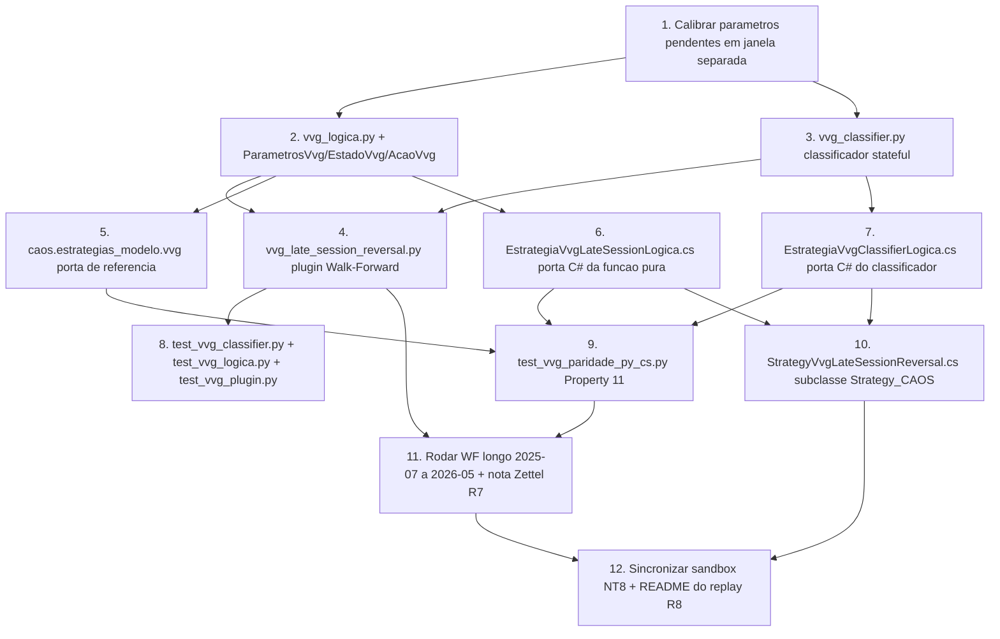

# Implementation Plan

> Spec — Estratégia VVG Late-Session Reversal (MNQ)

## Overview

12 tarefas que entregam a primeira estratégia direcional do CAOS
após o descarte da Crabel NR7 (`Decisao_2026-05-29-01`). Idioma
pt-BR; plataforma Windows + cmd para Python; NinjaScript Editor
(F5) para a versão C#. Integra com Walk-Forward (Spec 2),
Strategy_CAOS (Spec 3) e overlays do Spec 4 (SpreadFilter,
CircuitBreaker).

A primeira tarefa é **calibração obrigatória** dos parâmetros
pendentes (`stop_pontos`, `target_pontos`, `multiplicador_volume`,
`threshold_gap_pct`) na janela 2025-03-17 a 2025-06-30 (separada
do WF longo 2025-07 a 2026-05). Sem essa calibração, nenhuma
linha de código de estratégia é escrita — regra anti-overfit do
projeto.

## Task Dependency Graph



```json
{
  "waves": [
    {"wave": 1, "tasks": ["1"]},
    {"wave": 2, "tasks": ["2", "3"]},
    {"wave": 3, "tasks": ["4", "5", "6", "7"]},
    {"wave": 4, "tasks": ["8", "9", "10"]},
    {"wave": 5, "tasks": ["11"]},
    {"wave": 6, "tasks": ["12"]}
  ],
  "dependencies": {
    "1": [],
    "2": ["1"],
    "3": ["1"],
    "4": ["2", "3"],
    "5": ["2"],
    "6": ["2"],
    "7": ["3"],
    "8": ["4"],
    "9": ["5", "6", "7"],
    "10": ["6", "7"],
    "11": ["4", "9"],
    "12": ["10", "11"]
  }
}
```

## Tasks

- [x] 1. Calibração obrigatória dos parâmetros pendentes
  - Criar `scripts/calibrar_vvg_2026-05-29.py` que carrega
    `dados/MNQ/_concat_minute_last/01_MNQ_06-25.csv` e filtra a
    janela 2025-03-17 a 2025-06-30.
  - Para cada combinação de `multiplicador_volume ∈ {1.3, 1.5, 1.7}`
    e `threshold_gap_pct ∈ {0.0015, 0.003, 0.0045}`, contar dias
    VVG-positivos e selecionar a combinação que produz **15-25% de
    elegibilidade** (faixa coerente com ~17% reportado no abstract
    do paper Mesfin).
  - Calcular `stop_pontos` e `target_pontos` derivados de ATR(14)
    mediano da janela: `stop = ATR_mediano × 1.0`,
    `target = ATR_mediano × 2.0`. Arredondar para múltiplos de
    0.25 pts (tick MNQ).
  - Documentar todos os valores escolhidos em
    `CAOS_Zettelkasten/Walk_Forwards/Calibracao_VVG_2026-05-29.md`
    com print do output do script e justificativa.
  - **Cobre**: R10.2 (regra anti-overfit), pré-requisito de R1, R2.

- [x] 2. `caos/walk_forward/estrategias/vvg_logica.py`
  - Define `ParametrosVvg`, `EstadoVvg`, `AcaoVvg` (dataclasses
    frozen + enum).
  - Implementa `decidir_acao(barra, estado, parametros) ->
    tuple[AcaoVvg, EstadoVvg]` cobrindo R2 — função pura canônica.
  - Valores de `ParametrosVvg.PadraoConfigurado()` vêm do
    Zettel da tarefa 1.
  - **Cobre**: R2.1, R2.2, R2.5, R2.6, R10.

- [x] 3. `caos/walk_forward/estrategias/vvg_classifier.py`
  - Classe `VvgClassifier` stateful (mantém histórico rolling de
    `n_dias_baseline + 5` dias).
  - Método `on_barra(barra) -> Optional[ResultadoClassificacao]`
    que retorna resultado quando a janela morning fecha.
  - Garante que warmup incompleto SEMPRE devolve `vvg_positivo =
    False` (R1.4).
  - Aplica filtro de dia válido (sábado/domingo) e
    `MIN_BARRAS_DIA_VALIDO=300` (regra herdada do Spec 4).
  - **Cobre**: R1.1, R1.2, R1.4, R1.5.

- [x] 4. `caos/walk_forward/estrategias/vvg_late_session_reversal.py`
  - Classe `EstrategiaVvgLateSessionReversal` compatível com o
    Protocol `Estrategia` (Spec 2).
  - `treinar` aquece o classificador com barras do histórico;
    `on_barra` integra classificador + função pura + despacho;
    `finalizar` devolve `list[metricas.Trade]`.
  - Reaproveita `metricas.Trade` (Spec 2) — não cria modelo novo.
  - **Cobre**: R2 (despacho), R4.3 (risco USD via Cerberus
    futuro), R6.2 (sem random).

- [x] 5. `caos/estrategias_modelo/vvg.py` — porta de referência
  - Replica fielmente a lógica que vai pro C# em Python puro,
    sem dependência de pandas/numpy.
  - Usado pelo property test (tarefa 9) como ground truth da
    porta C# antes do código C# existir.
  - Estrutura paralela ao Spec 4 (`caos/estrategias_modelo/orb.py`).
  - **Cobre**: pré-requisito de Property 11 (paridade Python↔C#).

- [x] 6. `04_CODIGO/ninjascript/EstrategiaVvgLateSessionLogica.cs`
  - Porta C# **literal** de `vvg_logica.py`: `ParametrosVvg`
    (struct), `EstadoVvg` (struct ref), `AcaoVvg` (enum),
    `DecidirAcao(...)` (método estático).
  - Sem dependência de `Strategy` ou APIs NT8 — testável em
    isolamento.
  - **Cobre**: R5.1 (arquivo novo), R6.1 (paridade).

- [x] 7. `04_CODIGO/ninjascript/EstrategiaVvgClassifierLogica.cs`
  - Porta C# **literal** de `vvg_classifier.py`. Usa
    `Queue<KeyValuePair<DateTime, double>>` como buffer rolling.
  - Sem dependência de `Strategy` ou APIs NT8.
  - **Cobre**: R5.1, R5.5 (acesso a close(D-1) sem
    `AddDataSeries` adicional), R6.1.

- [ ] 8. Testes unitários Python
  - `tests/unit/test_vvg_classifier.py`: cobrir Properties 2, 3, 4
    + edge cases (warmup incompleto, dia inválido, baseline
    rolling).
  - `tests/unit/test_vvg_logica.py`: cobrir Properties 1, 5, 6, 7,
    8, 9, 12 + idempotência.
  - `tests/unit/test_vvg_plugin.py`: cobrir `treinar` aquecimento,
    `on_barra` integração, `finalizar` devolve trades canônicos.
  - **Cobre**: Properties 1-9, 12; R1-R4 testáveis.

- [ ] 9. `tests/property/test_vvg_paridade_py_cs.py`
  - Hypothesis com N=200 sequências OHLCV (mesma estratégia do
    Spec 4 Property 19). Compara
    `EstrategiaVvgLateSessionReversal` (Python) com
    `caos.estrategias_modelo.vvg` (porta de referência).
  - Critério de paridade: trades idênticos em direção, timestamp,
    preço de entrada/saída. PnL/trade dentro de 5%.
  - Falha em qualquer barra → bug em uma das portas.
  - **Cobre**: Property 11; R6.

- [ ] 10. `04_CODIGO/ninjascript/StrategyVvgLateSessionReversal.cs`
  - Subclasse de `Strategy_CAOS` (Spec 3).
  - `OnStateChange` configura `Name`, `Description`, `MaxContratos
    = 1`, e instancia o classificador em `State.DataLoaded`.
  - `OnNovaBarra` integra classificador + função pura + despacho
    via `EntrarLong` / `EntrarShort` / `SairLong` / `SairShort`.
  - Reusa **todas** as defesas de warmup do `Strategy.cs` (R5.3).
  - **Cobre**: R5.1-R5.5.

- [ ] 11. Rodar Walk-Forward longo
  - Script `scripts/rodar_wf_vvg_late_session.py` que invoca
    `caos walk-forward run` com a configuração canônica:
    - Janela: 2025-07-01 a 2026-05-15
    - Configuração: 60+10 anchored
    - Estratégia: `CB(SF(VVG))` composta
    - 1 contrato MNQ
  - Critérios de aprovação (R7.3):
    - Sharpe mediana ≥ 1.0
    - Calmar mediana ≥ 1.5
    - PnL total > 0
    - Sharpe positivo em ≥ 3/4 trimestres (year-stability)
  - Se falhar QUALQUER critério → fallback A automático
    (R9), arquivar em `02_ESTRATEGIAS/mortas/`, criar
    `Refutacao_VVG_Late_Session_<DATA>.md`.
  - Se passar TODOS → criar nota Zettel
    `Aprovacao_WF_VVG_Late_Session_<DATA>.md` (R7.5),
    atualizar `STATE-OF-RESEARCH` apontando avanço para R8
    (replay NT8). NÃO aplicar tag `caos-frozen-*` nesta tarefa.
  - **Cobre**: R7, R9.

- [ ] 12. Sincronizar sandbox NT8 + README do replay
  - Sincronizar repo → sandbox via
    `04_CODIGO/ninjascript/sincronizar.bat repo-para-caos`
    (R5.4).
  - Atualizar `04_CODIGO/ninjascript/README_INSTALACAO_HOLDOUT.md`
    com seção dedicada à `StrategyVvgLateSessionReversal`:
    - Days to load ≥ 44 (warmup do `BarsRequiredToTrade=19320`)
    - Sim101 obrigatório
    - Janela do replay: 60 dias úteis em 2026-06+ (R8.2)
    - Critério de aprovação (R8.3): PnL ≥ −USD 100, T ≥ 2.0
    - Critério de fallback A (R9.1): se replay falhar,
      arquivar automaticamente
  - Confirmar paridade 11→12 arquivos via
    `sincronizar.bat verificar`.
  - **Cobre**: R5.4, R8.5; pré-requisito do replay manual no NT8
    (executado fora desta task pelo usuário).


## Notes

### Premissas

- O paper arXiv 2605.11423 (Mesfin) admite no abstract que
  "all tested directional trading strategies fail institutional
  validation standards". A `Decisao_2026-05-29-03` aceita
  implementar mesmo assim sob critérios mais rigorosos
  (year-stability ≥ 3/4 trimestres, T ≥ 2.0, MaxContratos=1
  fixo permanente). É **plausível e esperado** que a estratégia
  seja refutada no WF longo (tarefa 11) — esse é o resultado
  aceito.
- A tarefa 1 é **bloqueante**. Sem calibração documentada, as
  tarefas 2-12 não podem começar.
- A tarefa 11 dispara o fallback A automático em caso de falha.
  Não há "tentar de novo com K diferente" — regra anti-overfit.
- A tarefa 12 prepara o replay NT8 mas o replay propriamente
  dito (60 dias úteis em 2026-06+) é executado **manualmente**
  pelo usuário no NT8 Sim101, fora do escopo desta task list.
  O resultado do replay alimenta uma futura Decisão de
  aprovação ou descarte.

### Não-objetivos

Conforme R10 do `requirements.md` — esta lista é vinculante:

- Não implementar HMM, VWAP, Cumulative Delta, Whale Trades,
  Order Book Imbalance, Hawkes.
- Não filtrar por VIX, Pre-FOMC, Turn-of-the-Month.
- Não usar HRV, Vagal Tone, TraderSync.
- Não implementar position sizing dinâmico via fórmula ATR.
- Não introduzir parâmetros otimizáveis novos (multiplicador,
  threshold, stop, target — todos são valores congelados em
  código após calibração da tarefa 1).
- Não modificar `EstrategiaSpreadFilter` ou
  `EstrategiaCircuitBreaker` (R3.4).

### Critérios de descarte automático (R9)

Disparados em qualquer momento do pipeline:

| Critério | Tarefa que detecta | Ação automática |
|---|---|---|
| WF: Sharpe mediana < 1.0 OU Calmar < 1.5 OU PnL ≤ 0 OU year-stability < 3/4 | 11 | Arquivar + Refutacao Zettel |
| Replay: PnL < −USD 100 em 60 dias OU T < 2.0 | manual após 12 | Arquivar + Refutacao Zettel |
| Paridade Python↔C# > 5% por trade | 9 | Suspender + Debate G5 |

### Tag de congelamento

Não aplicar `caos-frozen-vvg-*` em nenhuma tarefa desta lista.
A tag só vem após R7 + R8 ambos aprovados, em **Decisão formal
separada** (R8.6 do Spec 1).
