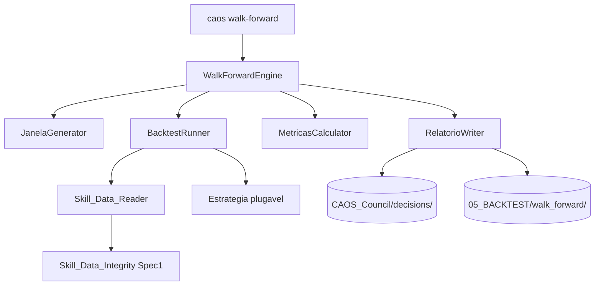

# Design Document

> Spec 2 — Pipeline de Walk-Forward em Python

## Overview

Este documento traduz os 10 requisitos do Spec 2 em uma arquitetura Python concreta que se integra ao Conselho do Spec 1. O pipeline é estruturado em 5 componentes desacoplados, cada um testável em isolamento, e expõe uma CLI sob o entry point `caos walk-forward`.

- Overview → seção 1
- Architecture → seção 2
- Components and Interfaces → seção 2
- Data Models → seção 3
- Error Handling → seção 8
- Testing Strategy → seção 9
- Correctness Properties → seção 9

## Architecture

Hub-and-spoke: o `WalkForwardEngine` orquestra `JanelaGenerator`, `BacktestRunner`, `MetricasCalculator` e `RelatorioWriter`. Todos consomem `Skill_Data_Reader` para acesso aos CSVs.



## Components and Interfaces

| Componente | Responsabilidade | Cobre |
|---|---|---|
| **WalkForwardEngine** | Loop principal: gera janelas, despacha cada uma ao Runner, agrega Resultados, escreve relatório | R1, R2, R7, R8 |
| **JanelaGenerator** | Produz lista determinística de Janela_WF a partir de ConfiguracaoWalkForward + intervalo de dados disponíveis | R3 |
| **Skill_Data_Reader** | Lê CSVs do `dados/MNQ/`, valida schema (timestamp,open,high,low,close,volume), invoca Skill_Data_Integrity antes da primeira leitura | R4 |
| **BacktestRunner** | Executa uma Janela_WF: injeta barras de Treino, chama `Estrategia.treinar(...)`, depois injeta barras de Teste barra-a-barra via iterator que detecta look-ahead | R5 |
| **MetricasCalculator** | A partir do log de trades de uma janela, calcula Sharpe, Calmar, drawdown, win_rate, MFE/MAE médios, payoff | R6 |
| **RelatorioWriter** | Serializa Resultado_Walk_Forward em JSON canônico + Markdown auditável; integra com Council_Recorder do Spec 1 | R8 |

## Data Models

### `ConfiguracaoWalkForward` (Pydantic)
```yaml
tamanho_treino_dias_uteis: int  # 60 a 504
tamanho_teste_dias_uteis: int   # 10 a 120
passo_dias_uteis: int           # default = tamanho_teste
instrumento: str = "MNQ"
granularidade: Literal["1m", "tick"]
seed: int = 42
```

### `JanelaWF`
```yaml
indice: int                     # 0-based
treino_inicio: datetime         # UTC
treino_fim: datetime
teste_inicio: datetime
teste_fim: datetime
hash_dados: str                 # SHA-256 do subset usado nesta janela
```

### `ResultadoJanela`
```yaml
janela: JanelaWF
estrategia: str
configuracao: ConfiguracaoWalkForward
sharpe_anualizado: Optional[float]
calmar: Optional[float]
drawdown_maximo_percentual: Optional[float]
drawdown_maximo_dias: Optional[int]
win_rate: Optional[float]
payoff_medio: Optional[float]
mfe_medio: Optional[float]
mae_medio: Optional[float]
numero_trades: int
pnl_total: float
look_ahead_violation: bool
status: Literal["ok", "falha", "sem-trades"]
motivo_falha: Optional[str]
duracao_ms: int
```

### `ResultadoWalkForward`
```yaml
identificador: str              # AAAA-MM-DD-NN
estrategia: str
configuracao: ConfiguracaoWalkForward
manifesto_hash: str             # SHA-256 agregado dos dados lidos
janelas: list[ResultadoJanela]
agregado_mediana: dict[str, float]
agregado_media: dict[str, float]
versoes_dependencias: dict[str, str]   # {"pandas": "2.x", "numpy": "1.x", ...}
status: Literal["concluido", "abortado-por-falhas", "manifesto-invalido"]
```

### Schema do CSV consumido em `dados/MNQ/`
Esperado (mínimo) — formato decidido neste Spec:
```
timestamp,open,high,low,close,volume
2025-01-02T13:30:00Z,21500.25,21501.50,21499.75,21500.75,1234
```
- `timestamp`: ISO 8601 UTC (sufixo `Z`).
- Demais colunas: numéricas.
- Linhas ordenadas cronologicamente (validado no Reader).

## Loop principal (pseudocódigo)

```python
def executar(estrategia: Estrategia, config: ConfiguracaoWalkForward) -> ResultadoWalkForward:
    Skill_Data_Integrity.assert_ok()                # R4
    barras = Skill_Data_Reader.carregar(config.granularidade)
    janelas = JanelaGenerator.gerar(barras, config)  # R3
    resultados = []
    for janela in janelas:
        try:
            r = BacktestRunner.executar(estrategia, janela, barras, config.seed)
            resultados.append(r)
        except Exception as exc:
            resultados.append(ResultadoJanela.falha(janela, exc))
    if taxa_falha(resultados) > 0.30:
        return ResultadoWalkForward.abortado(resultados)
    return ResultadoWalkForward.concluido(resultados)
```

## Detecção de Look-Ahead

`BacktestRunner` envolve as barras do Periodo_Teste em um `BarrasTesteIterator` que:

1. Mantém um cursor `i` (índice da barra atual).
2. Expõe `barra_atual()` e `historico_ate_agora()` (apenas barras 0..i).
3. Lança `LookAheadException` se a Estrategia tentar `barras[j > i]`.

Isso é validado pelo PBT da Property "Walk-Forward Sem Look-Ahead".

## Reprodutibilidade

- `random.seed(config.seed)` antes da primeira invocação da Estrategia.
- `numpy.random.seed(config.seed)` no início de cada janela.
- Versões de `pandas`, `numpy`, `python` registradas em `versoes_dependencias`.
- JSON canônico (`indent=2`, `sort_keys=True`, `ensure_ascii=False`) — igual ao Spec 1.

## Error Handling

| Cenário | Resposta |
|---|---|
| Manifesto divergente | Aborta; status `manifesto-invalido` |
| Janela individual falha | Registra `status: falha` na janela, prossegue |
| > 30% de janelas falham | Aborta o Walk-Forward inteiro |
| Estrategia tenta acessar barra futura | `LookAheadException`, marca janela `look_ahead_violation: true` |
| Dados sem trades no Teste | `status: sem-trades`, métricas como `null` |

## Testing Strategy

Mesma disciplina do Spec 1: PBT via Hypothesis + unit tests. Properties novas:

### Property 13: Walk-Forward Sem Look-Ahead
For every (estrategia, janela), no execution of the BacktestRunner SHALL access bars whose timestamp is greater than the current bar timestamp during the Test phase.

**Validates: Requirements 5.1, 5.2, 5.3, 5.4**

### Property 14: Walk-Forward Determinismo
For every pair of executions with same `(seed, ConfiguracaoWalkForward, manifesto_hash, estrategia_versao)`, the resulting `ResultadoWalkForward` SHALL be byte-identical (after JSON canonical serialization).

**Validates: Requirements 7.1, 7.2**

### Property 15: Janelas Não-Sobrepostas
For every pair of `JanelaWF` `(j1, j2)` produced by the same generator, `j1.teste_fim < j2.teste_inicio` OR `j2.teste_fim < j1.teste_inicio`.

**Validates: Requirements 3.1**

## Estrutura de Diretórios

```
05_BACKTEST/
  walk_forward/
    janelas/        # 1 JSON por janela, formato AAAA-MM-DD-NN-{slug}.json
    agregados/      # 1 JSON por execução completa
    relatorios/     # 1 Markdown por execução, frontmatter NotaZettel

CAOS_Orchestrator/caos/walk_forward/
  __init__.py
  engine.py
  janelas.py
  metricas.py
  relatorio.py
  estrategias/
    __init__.py
    base.py         # Protocol Estrategia
    exemplos/       # estratégias-stub para testes
```
