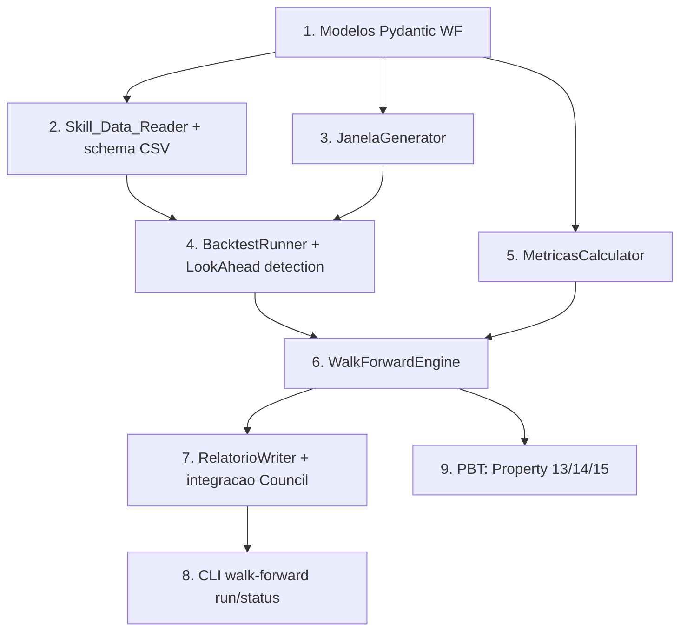

# Implementation Plan

> Spec 2 — Pipeline de Walk-Forward em Python

## Overview

Plano de execução do Spec 2. Cada tarefa cobre um componente do design e cita requisitos + Properties novas (13–15). Idioma pt-BR; plataforma Windows + cmd; integra com o Spec 1 (Skill_Data_Integrity, Council_Recorder, models Pydantic).

**Pré-requisito operacional:** ter os arquivos do MNQ em `dados/MNQ/` e ter rodado `caos manifesto build` para gerar `manifesto.json`. Sem isso, T2 e T6 não podem ser validadas com dados reais — mas podem rodar com fixtures sintéticos.

## Task Dependency Graph



```json
{
  "waves": [
    {"wave": 1, "tasks": ["1"]},
    {"wave": 2, "tasks": ["2", "3", "5"]},
    {"wave": 3, "tasks": ["4"]},
    {"wave": 4, "tasks": ["6"]},
    {"wave": 5, "tasks": ["7", "9"]},
    {"wave": 6, "tasks": ["8"]}
  ],
  "dependencies": {
    "1": [],
    "2": ["1"],
    "3": ["1"],
    "4": ["2", "3"],
    "5": ["1"],
    "6": ["4", "5"],
    "7": ["6"],
    "8": ["6"],
    "9": ["6"]
  }
}
```

## Tasks

- [ ] 1. Modelos Pydantic do Walk-Forward (`caos/walk_forward/models.py`)
  - Implementar `ConfiguracaoWalkForward`, `JanelaWF`, `ResultadoJanela`, `ResultadoWalkForward` com validators.
  - Testes unitários cobrindo limites (Treino ≥ Teste, ranges).
  - **Cobre**: R2, R6.

- [ ] 2. Skill_Data_Reader e schema CSV (`caos/walk_forward/data_reader.py`)
  - Carrega CSVs ordenados cronologicamente; valida schema (`timestamp,open,high,low,close,volume`).
  - Invoca `Skill_Data_Integrity` (Spec 1) antes da primeira leitura.
  - Testes unitários com CSVs sintéticos em `tmp_path`.
  - **Cobre**: R4.

- [ ] 3. JanelaGenerator (`caos/walk_forward/janelas.py`)
  - Produz lista determinística de `JanelaWF` dado um intervalo de barras + `ConfiguracaoWalkForward`.
  - Testes unitários para casos: 0 janelas (dados insuficientes), 1 janela, N janelas, passo customizado.
  - **Cobre**: R3.

- [ ] 4. BacktestRunner + LookAhead detection (`caos/walk_forward/runner.py`)
  - Executa uma janela; envolve barras do Teste em `BarrasTesteIterator` que detecta look-ahead.
  - Testes unitários: estratégia válida, estratégia que tenta look-ahead (esperado `LookAheadException`).
  - **Cobre**: R5.

- [ ] 5. MetricasCalculator (`caos/walk_forward/metricas.py`)
  - Sharpe anualizado, Calmar, drawdown máx (%, dias), win_rate, payoff médio, MFE/MAE médios, número de trades, PnL total.
  - Testes com séries sintéticas: 0 trades, 1 trade, sequências de losses, sequências de wins.
  - **Cobre**: R6.

- [ ] 6. WalkForwardEngine (`caos/walk_forward/engine.py`)
  - Orquestra: integridade → geração de janelas → execução por janela → agregação.
  - Aborta se >30% das janelas falharem.
  - Testes unitários ponta-a-ponta com fixture sintético.
  - **Cobre**: R7, R10.

- [ ] 7. RelatorioWriter + integração com Council (`caos/walk_forward/relatorio.py`)
  - Serializa `ResultadoWalkForward` em JSON canônico + Markdown.
  - Frontmatter compatível com `NotaZettel` (área `Decisoes_do_Conselho`).
  - Opcional: chama `CouncilRecorder.gravar` quando flag `--commit` for usada na CLI.
  - **Cobre**: R8.

- [ ] 8. CLI `caos walk-forward run|status` (`caos/main.py`)
  - Estende a CLI do Spec 1 com novo subcomando.
  - Testes via subprocess (mesmo padrão do Task 17 do Spec 1).
  - **Cobre**: R9.

- [ ] 9. Suite PBT: Properties 13, 14, 15
  - `tests/property/test_walk_forward_no_lookahead.py` — Property 13.
  - `tests/property/test_walk_forward_determinismo.py` — Property 14.
  - `tests/property/test_walk_forward_janelas.py` — Property 15.
  - Atualizar `test_property_coverage.py` para incluir as 3 novas.
  - **Cobre**: R5, R7, R3.

## Notes

- Estratégias de exemplo em `caos/walk_forward/estrategias/exemplos/` ficam apenas como stub — estratégias reais virão em Specs 4+.
- Métricas usam **mediana** como default (não média), conforme R6.3, para resistência a outliers.
- `pandas`/`numpy` já estão em `pyproject.toml` ou serão adicionados na T1.
